---23/05/22 13:47:38----------------------

Today I want to talk about design of things, that is the way that things look like. This can be big things like houses and buildings like schools. This can also also about smaller things that we have in our house: chairs, tables, lamps, tea pots.

One hundred and fifty years ago people wanted houses and buildings to look like they did in the Roman Empire and classical Greece, the Roman Empire existed some two thousand years ago, that was a long long time ago.

An example of a building from the Roman Empire: the Pantheon in the city of Rome, this was a Roman temple when it was built, now it is a church.
It is the only building from that time that is still standing - the same as it was built.

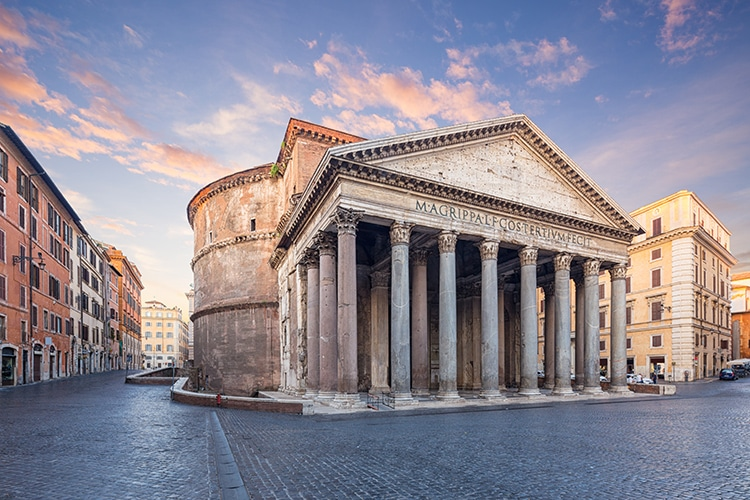

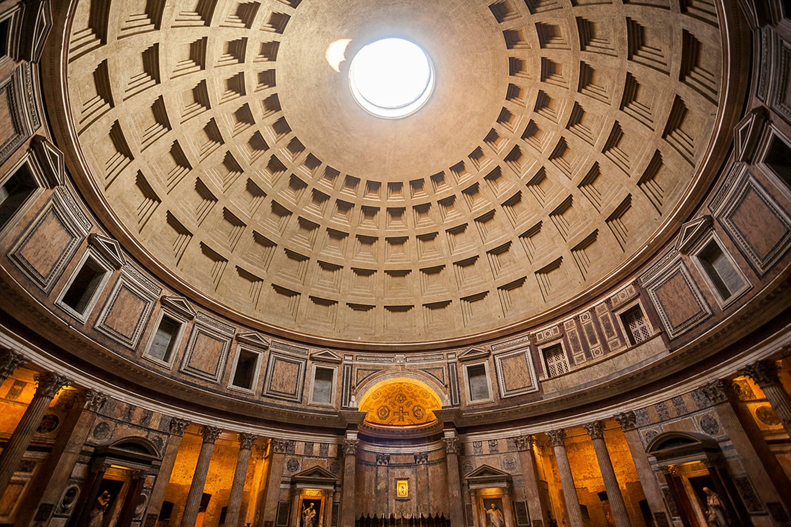

This building tells you something: we could build such a big thing, and we have a lot of power, so you better do what we say, else...

--

You can see the same style of building in the late nineteenth century, almost two thousand years later, like with the building of the British museum:

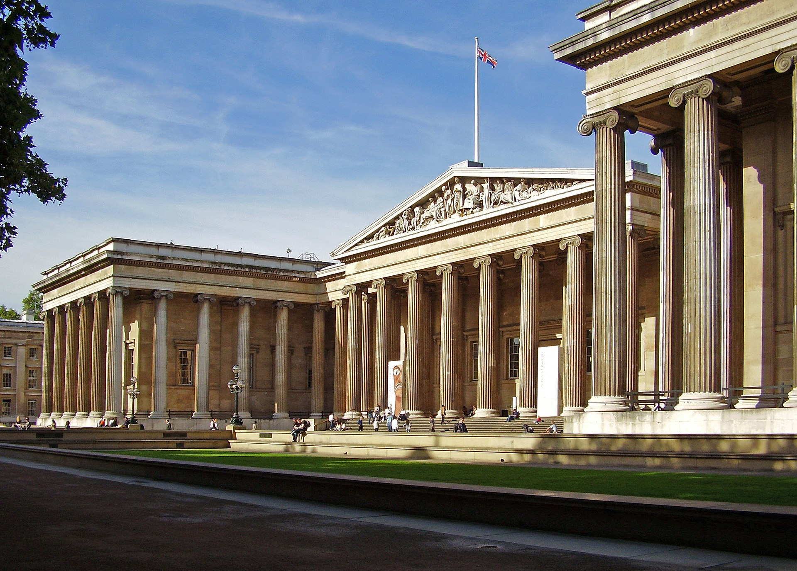

The main court of the USA - the supreme court, also built in the nineteenth century

Also they liked to use the same ornaments in the nineteenth century, like in ancient Greece.
The old ornaments:

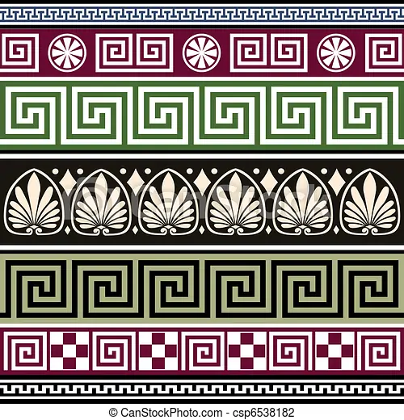

Here is a room from the late 19th century designed like this:

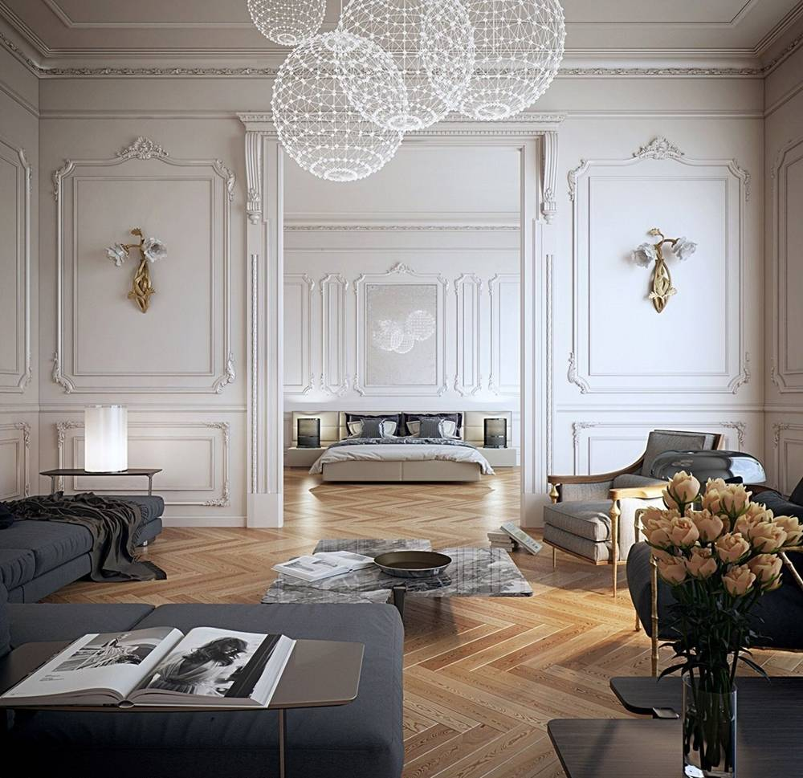

Showing off how strong your are was very important in the late nineteenth century.
Most of Europe had kings and queens and they didn't like changes, because any change of government would have thrown out the kings and the queens.

Germany had the kaiser Wilhelm I and Wilhelm II - a kaiser is a kind of king.
Austria had an Emperor was a very big country, it ruled over Hungary, Czechia, Slovakia, big parts of former Jugoslavia and Poland, an emperor is also a kind of king
Russia had an Emperor and Britain had a queen (but she doesn't have to say anything)

--

Then came world war one, from 1914 to 1918, that was a terrible war, where some fourteen million people died, in all of Europe.

That was one big and terrible war, after the war most of the kinds and queen were thrown out (except for the queen of England)

Most countries got a parliament instead of them (except for Russia, which got a dictatorship instead)

-- 

Now people were asking how stuff like houses lamps and tea pots should look like...

What we got instead of neoclassical design is a modern design of things that you can still see today at Ikea!

Someone had to invent this design, this was done in Germany at a school called the Bauhaus (that means a house for the art of building).

What they did was very new: they said that we have to find new ways of thinking about design.

To do this they had a lot of people in one school:
 - they had artists who knew how to paint modern paintings
 - they had craftsmen - to learn how to do things like lamps and tea pots
 - they had architect - to learn how to do new kinds of houses

We will learn more about the Bauhaus in the next lesson.

---11/06/22 05:50:40----------------------

Back to the Bauhaus, and to how things are designed

Now we talked about world war one, and that it came as a big shock to many people.
Most people thought that things can only get better, they were very optimistic, here is why:

This is a graph, it tells you the cost of all things that were made in England for any year from 1200 to 1917.

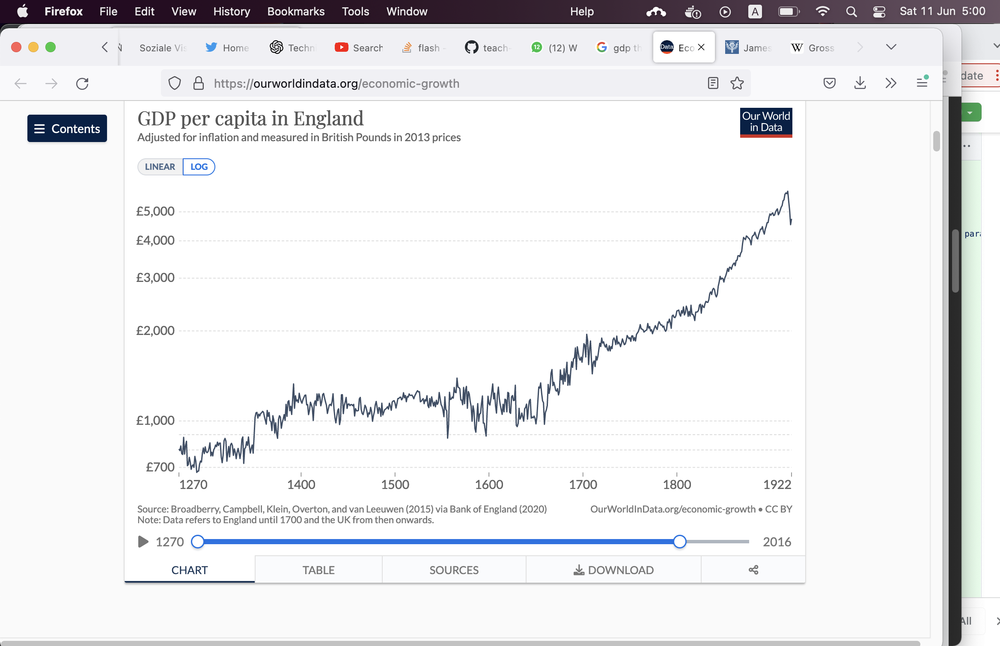

You see that things were really getting better, the world was getting richer - ever since 1764, when James Watt invented the steam engine.

Here is a steam engine can create a lot of new energy. 

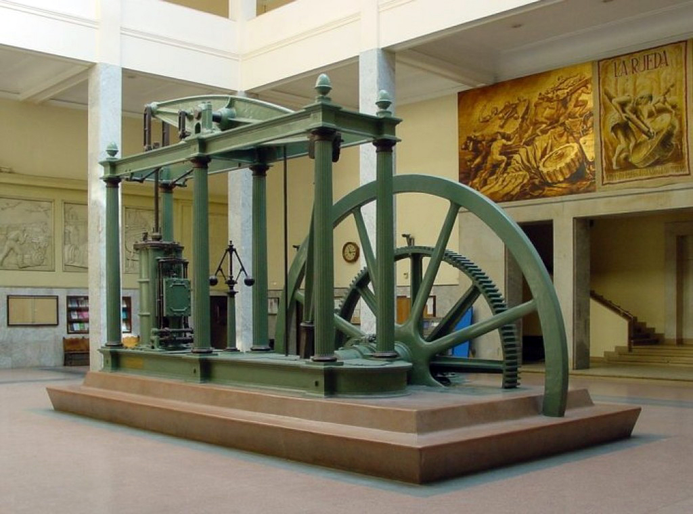

you burn coal, it warms water that turns into steam, this steam moves the machine forward!

Without the steam engine we had the energy of horses and donkeys. Well, we had the power of a flowing river, you can make the flowing water move a big wheel.
There is a problem with that - you can only have that next to a river, but you can put a steam engine almost everywhere.

And a hundred years after the steam engine people also started to use electricity, that's even more energy.
Some people were getting richer and richer!

Now with all this power you can make much better weapons too, these weapons can destroy a lot of things. Progress is not always good, it has a dark side as well...

You had a lot of destruction in world war one, that was the first modern war. Everything new was used to kill even more soldiers, you got very new stuff like air planes, u-boats that swim under the sea and poison gas and lots and lots of very big guns that can blow up a big area with dynamite - that was a new explosive much stronger than gun powder.

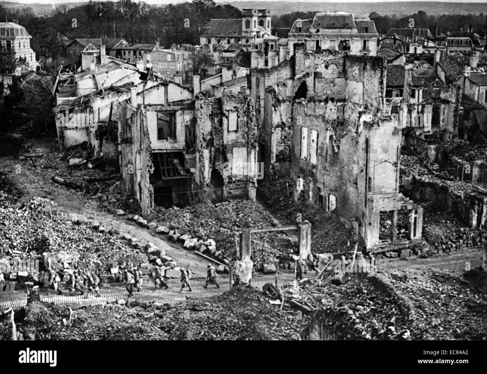
That was a very big battle - a battle of Verdun, about a million soldiers died there!

So after world war one, a lot of people thought: what shall we do now?

One thing that helps people in difficult times is art, so you had a lot of changes in art.
Some people became interested in the Chinese and Japanese philosophy and art - they thought that Europe did not have all the answers, and that they had to look for new places for answers.

Tao or Dao is a way of thinking from China, they want to find harmony with nature, they also say that one should do as little as possible - because you would mess up nature if you do too much.  
In Japanese art you have Wabi-Sabi, here artists try to have a beautiful painting with as little as possible, this is called minimalism.

Interesting that Martin Buber was saying that Tao/Daoism has many similarities with Hassidism.

You have a similar style of thinking in tech, Antoine de Saint-Exupéry is a french writer, he wrote the following (I used to read his book a lot, when I was your age :-)
He says that an airplane is nearest to perfection, when ... there is no detail that can be removed from it.

“And now, having spoken of the men born of the pilot's craft, I shall say something about the tool with which they work - the airplane. Have you looked at a modern airplane? Have you followed from year to year the evolution of its lines? Have you ever thought, not only about the airplane but about whatever man builds, that all of man's industrial efforts, all his computations and calculations, all the nights spent over working draughts and blueprints, invariably culminate in the production of a thing whose sole and guiding principle is the ultimate principle of simplicity? ...
In anything at all, perfection is finally attained not when there is no longer anything to add, but when there is no longer anything to take away, when a body has been stripped down to its nakedness."

From "Wind, Sand and Stars" Antoine de Saint-Exupere

In a way this minimalism is similar to the sense of beauty in a mathematical proof, this one is also beautiful, if you can't take anything away from it.

That's what you later got in the esthetics of Bauhaus.

Ludwig Mies van der Rohe was the chief architect of Bauhaus and he said "Less is more" !

Much later you can see the same thing with ... telephones!

We had this telephone at our home, when I was a little kid. How do you dial a number? Stick your finger in a number and move the hole as far as possible!

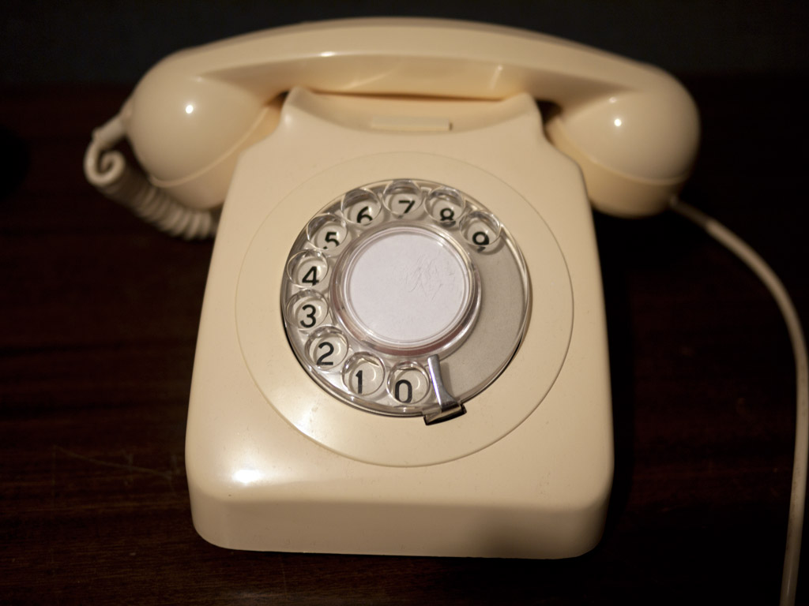

Later you had these - easier to use, but it still needs to be connected to a plug in the wall

Later you could put them in your pocket, the first cell phone that I got looked like this (you could play snake on it ;-)

Then these phones got a stronger computer, and you would have something like this! It even has a keyboard!

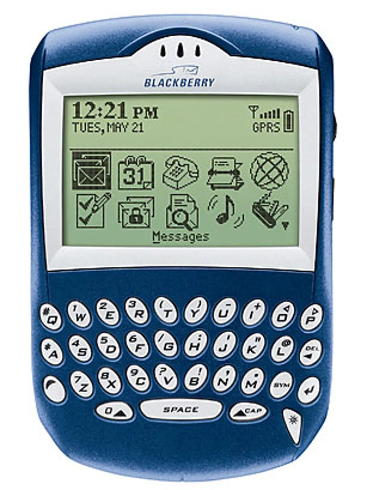

(some people actually say that it is much easier to type with the keyboard on a blackberry - easier than what you have now)

But then cam Steve Jobs and asked: what can you remove from the phone? Is there something that you could do without?

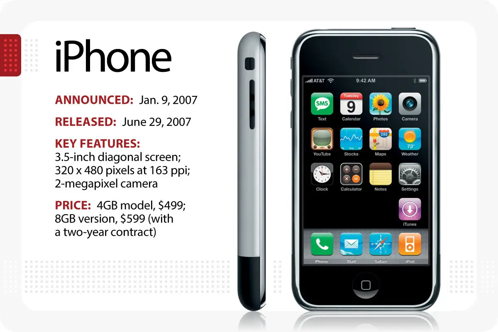

(Actually you had to add a touchpad for that, so it's not only removing stuff)

---

... and here is the full graph for the GDP growth in Britain, for almost a thousand years. You see that science and technology really changed things...

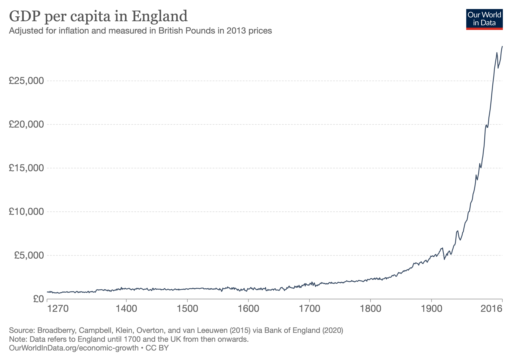

... But some people say that there is a big error here: the same amount of money today is worth less than a hundred years ago. That's called inflation - one pound from a thousand years ago could bye many more things than today.

---23/06/22 10:49:18----------------------

Bauhaus wrapup:

So the Bauhaus was about minimalism - that is about finding a simple way to express your art, and about bringing this art to everybody - in the form of designing things like chairs, lamps, houses, fonts for writing, clothes and paintings.

Like with the Bauhaus chair by Marcel Breuer - so you see where Ikea is getting their ideas...

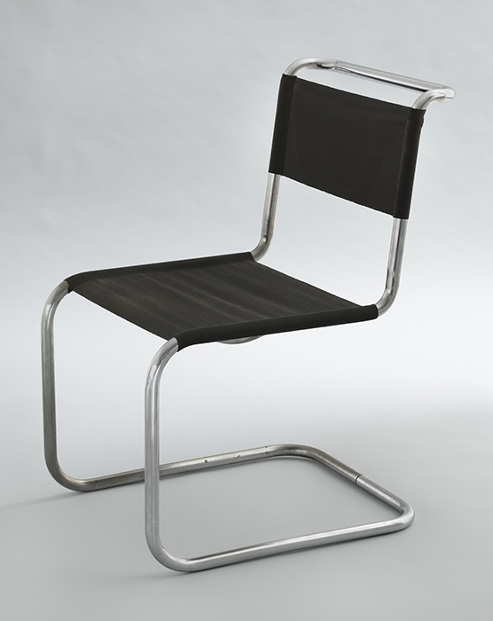

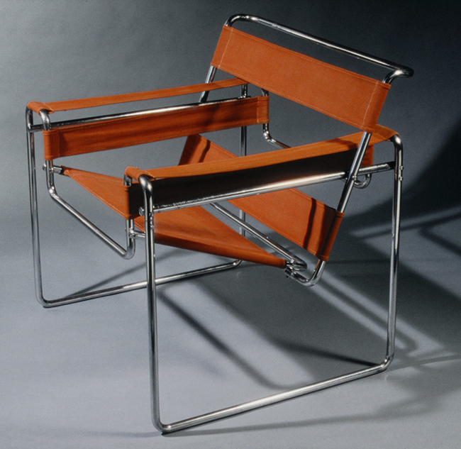

This lamp by Wilhelm Wagenfeld

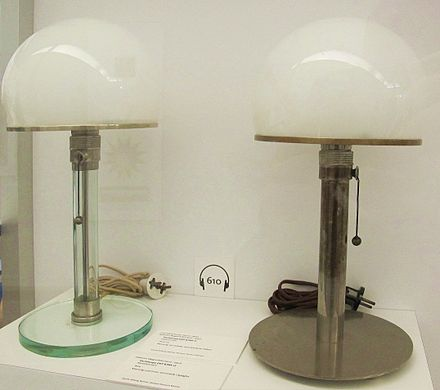

And this teapot by the same artist

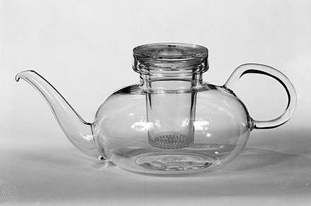

Minimalism means that you use only a few features, just the most important ones. So you need to know your stuff well: know a lot about shapes, materials, movement.

Students at the Bauhaus had a foundation course - here they learned about things likes basic shapes - these are square, triangle and circle - everything is reduced to these shapes

They learned about movement and had theater classes

The teacher of this course said: "before you draw a tiger, you have to roar like a tiger" - you need to experience 

After this first course they were learning about materials and how to use them in different workshops - metal workshop, weaving workshops, architecture workshops, etc.

In later years the school focused on architecture - we see a lot of that in Tel-Aviv, which is called the "white city", there are a lot of building that were built like this:

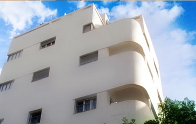

 

Most of the artists had to go to other countries, when the Nazis took power in Germany.
This style then became very common in a lot of places, all around the world.
Tel-Aviv was a city that was under constructions, a city was growing fast in that time, and a lot of buildings were built in that style.

Here is an interesting documentary on the subject: https://www.youtube.com/watch?v=2a45UBCIbJc
