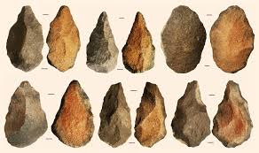
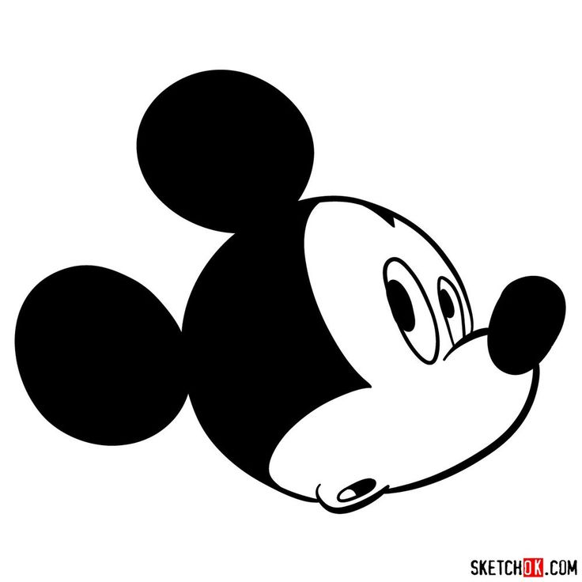

---23/06/22 17:15:30----------------------

Now we are going to talk about the movie Wall-E

Here you have the song that comes after the movie:

https://www.youtube.com/watch?v=hscu7cc1_2Y

You have robot Eve and robot Wall-E, they both go through paintings.
Each of these paintings is coming from a different time:

First you have the paintings on the walls of caves (caves are like big holes in mountains and people lived there) That was some 60000 years ago.
These were painted during the ice age, when half of Europe was under a big block of ice. These are the first examples of big art, paintings that are very big, on the walls of caves - that's where we got culture from, and some people say that language came from this time.

Then at 00:19 you are in painting that is just like the painting on the walls of a pyramid in ancient Egypt (from 5000-2300 years ago)
Egypt was one of the first places with cities and one of the first languages that wrote things down. 
History starts where we can find books what people wrote at the time, everything before that is the time before history - pre-history.

At 00:30 you get into a painting from ancient Greece - you see a lot of ornaments; this is the culture that tells us how to think. They taught us philosophy and mathematics, and critical thinking - that's when you ask questions why things are the way they are.
The Jews were also good at critical thinking - the prophets would ask the kings of Israel questions, and even challenged them - they would tell the king if he did something bad!

at 00:44 you are in a mosaic, that is a picture that is made from very little stones, they like these in ancient Rome (2500-1600 years ago)
Rome built a big empire, and united many people - most countries in Europe say that they come from this time.

at 01:00 comes a painting from China - that's where paper was invented, with very fine lines.

at 1:17 we get back to Europe during the renaissance - that's between six hundred and three hundred years ago in Italy
That's when Europe got back to the tradition of ancient Greece and ancient Rome, and when we learned things like science.
In art they learned about perspective, depth and Humanism - that people are the most important and should come first.

at 1:30 we get into 19th century France - the early impressionist; they taught us to draw what we feel, and not just what we see.

at 1:40 they are in a painting by Monet, many many small dots, like pixels.

at 1:47 they are in a field with sun flowers, just like Van Gogh

at 2:08 in a surrealist painting, where the roots of the tree come all into the boot where Wall-E found the plant/flower.
Surrealist means that this is not real, trees don't have roots like this.
You draw like this if you want to show ideas, not things that exist in the real world.

You see that two robots are going through a journey, as if they learn again what humans learned through their own journey, and all that through the eyes of art.
Art is like a kind of time machine, if you look at both the art and its time.
And that's what we will talk about now...

---

The very first art that we know about is here, it comes from three million years ago!

    

This small stone is a crystal, it looks a bit like a face, and the people of three million years ago added some scratches, to make it look more like a face.
This crystal does not come from the cave, you can find it 30 kilometer away from that cave.
This means they had to take and move the stone all by themselves!

Is that art? The stone could mean a lot to the people who brought it to the cave - they found it far away and had to keep it!

These people were before Humans, they are called Australopithecus - we know very little about this kind of people, we have only the bones of the head, and some tools that they made.
https://simple.wikipedia.org/wiki/Australopithecus

---
Here is some more art from a very long time ago:

This is the "Venus of Berekhat Ram" : a stone figure of a women that was found in Israel, you can see it in the Israel museum in Jerusalem, it is from 280000 years ago!
It had some paint on it, so many scientist think that this was art.

There are many museums in the world, but you need to go to Jerusalem, if you want to see the first art ever!


This was before Humans- but we know much more about the artist! 

This is Homo Erectus scientists found much more than the bones of a head here, we know that he could walk and stand straight on his feet (that's what the name Homo Erectus says) https://simple.wikipedia.org/wiki/Homo_erectus

We think they looked like this


People know that they got out of Africa, they got to Europe and Asia, and even crossed the sea to the island of Java.

You need boats to cross the sea to that Island, it is too hard to swim that distance!

They made very complicated tools like this one:


And this:



It takes hundred of hours to make one like this, you need to plan what to do.
You also need to teach your children how to make these, so they must have known how to talk, somehow.
Maybe they were talking by making signs with their hands, but we don't know exactly.

But we don't know for sure, they all died, and now we have no Homo Erectus to ask...

---

We don't know how Homo Erectus talked to each other.
Some scientist say that they must have had some language - to teach their kids how to make complicated tools.

They didn't have a larynx and a complicated tongue.
A larynx is what you have in your throat, you need that to make sounds for speaking


But you can teach a Gorilla or a Bonobo some sign language. Sign language is what Humans who can't speak use.

Here is an example of American Sign language - that's how you talk with a person who can't speak.

https://www.youtube.com/watch?v=p0ufyoe0URA

Here is Koko - she was a Gorilla who learned human sign language! She could tell us simple stuff.

https://www.youtube.com/watch?v=FqJf1mB5PjQ

Maybe Homo Erectus could talk about more complicated things with his hands! He had a bigger brain and could stand on his feet - that means that his hands were not busy with moving him from one point to the other.

Also Homo Erectus knew how to make fire, that means he could cook his food. Cooked food has more energy in it, so he didn't have to eat plants all day.


---28/06/22 01:45:44----------------------

Now fast forward to the ice age - you already have Humans in Europe - Homo Sapiens, that's us.

At the time of the ice age you had a very large block of ice. This block of ice was covering half of Europe. The weather was much colder than now. The ice age was from 60.000 years ago until 10.000 years ago.

In Germany you can sometimes see some very big stones, in a place where you don't have any mountains. These big stones are near Berlin. They got there because this big block of ice moved the stones from far far away!


Now a lot of things happened during the ice age, things were very cold and people had to fight hard to survive. At this time they make tools that get much more complicated. 


You can use these to catch fish. They also had bows and arrows!


People were hunting big animals, like Bison, Reindeer and stone age Rhinos with a big horn. You had to take these stones and glue them onto a stick, then some of these spears could be used for throwing, with some of them you can't do that - you take that spear and run up to the animal and stick it into it.

Some 30.000 year ago they also made music! This is a flute made out of some piece of bone  


And 20.000 years ago we got dogs! Once there were only wild wolfs, no dogs. Dogs were wolfs, who got used to living with people!

Now some scientists say that that that's the time when people learned how to speak!

But the biggest thing that archaeologists found are drawings in caves - a cave is a hole in a mountain. Some of the drawings are from 40.000 years ago! You can find the paintings in some caves in Spain and France. You can also see paintings in the Sahara dessert - that was not a desert at the time, it had grass and lots of animals were living there.

Look at this painting of a bison from the Altamira cave in Spain  (from 14000 years ago)


You see they knew about perspective - look at the legs, the leg that is near to us is drawn stronger.
And it's a three dimensional painting - some parts are near to us, some are further away.

How did they do it? They used ochre color - you take some special stone/clay that has some iron in it - that's why it is red. You need to turn it into dust and add some fat to it - the fat makes the color stick to the wall.
You can also make a paint that is made from charcoal - that is wood after you burn it, then it turns black and you can make a some black paint out of it.

Then they took some paint and blew the paint onto the wall by moving the air with their mouths. As if they breathe life into the painting! That's not just some wall, it's the ceiling - above their heads. So they had to use lamps to put some light into the cave.

Why did they do these paintings? We don't know for sure, but we are guessing. There is a science called anthropology - scientists go to far away places like the amazon and Australia and Africa, some groups of people live there as if in the stone age - they did not have any contact with anyone else. The anthropologists live with them, learn their language and their culture. This way we can guess what the people were thinking some 30000 years ago.

Archaeologists dig up stuff, and they can also tell from what time it was. They use different tricks to do that.

There is also another direction - we think about the art, how does art work? What does it mean? How does it move us?

Linguists think about language, and where it came from and how language is working. That means they also think about the way we think.

You see that this is a big puzzle, and you get ideas from many areas of study. More about this in the next lesson.

---29/06/22 05:01:30----------------------

here someone made art with a cup of coffee and some milk foam.


What has that got to do with the history of art? The first cave paintings appear 40.000 years ago, but Homo Sapiens already exists for some two or three hundred thousand years, does it mean that art was a very late invention?

We don't know, it can be that people had some art before, just that we don't know about it. The cats on top of the coffee will not survive for a hundred thousand years, maybe people did some other art earlier, like painting on their own bodies or painting on baskets.

We don't know for sure, but they found ochre paint that comes from earlier than 285.000 years ago, it is much older than the cave paintings! What do you do with paint? Something that has to do with art!

-----

Not what is art? You draw something, it looks like it is real, but the painting is not real.


This is a painting from 1928 by Rene Margarite. The text on the painting is in French, it says: "this is not a pipe".
People asked the painter: but we can see a pipe on the painting. this is a pipe!
Rene answered: if it is a pipe, then take it and smoke it!

You see that art is a bit different, or very different from a real thing. It is a symbol.
Art is about the artist talking to the people who see the painting - the artist wants to tell us something.
The artist can talk about something real, but also about his feelings - but he wants to make us feel something with his art!

The cats in the coffee cup tell us: this is cute! Or the artists wants to say "i put in a lot of work in this cup, you want to drink the coffee, but how can you take it and destroy my art?" or maybe it means something else...

Pablo Picasso said that "art is a lie that helps the artist to tell the truth" - the picture is not the same as the real thing, often the artist is using tricks that help him to tell us something, but these tricks move the painting away from the real thing.

People get very exited about the old paintings on the caves - it tells us that people from 40.000 years ago thought abstract ideas - that is about things that you can't touch or use as tools. That means that they thought the same like us! 

----

Dolev asked me about the scratch marks on one of the tools:

Thats a good question. Yesterday I saw something on youtube. Genevieve von Petzinger is looking at symbols drawn in caves, she made a catalog of all symbols that she found. https://www.youtube.com/watch?v=hJnEQCMA5Sg


She says that the sign with the dots is very often found!

maybe even possible that these scratches count something, or that it is for beauty.

Geneve became a big star in Antrophology for asking your question!

No one was bothering with the signs, everyone was cool with the paintings. Now they say that Genevieve is a big star, because some six and half million people saw her talk on youtube! She was asking just the same questions as you do!


---01/07/22 05:24:13----------------------

Back to the cave paintings, you can see a many drawings of animals, they are drawing a lot of details.
This means they are naturalistic pictures - they try to look like they look in nature.

Like the Bisons in altamira cave - they are sometimes drawing around cracks in the stones.


Or in Chaveaux cave


 

Look at the horns of the animal in the last picture - that's a trick.
You see the animal from the side, but the artist is drawing two horns, you would see only one horn from this perspective!

also see this one from lascaux cave


Like with Mickey mouse - you would not see both ears from the side. The same trick here:


People are often drawn in the same picture, but in less details. This means they are often more abstract.

Also you have a lot of signs, maybe they stand in for people, 


Maybe they wanted to draw the soul of the animal, maybe they had a fascination for the strength of animals and people were less interesting.
Maybe their religion would not allow drawing people, we have that in Judaism.

That may be like a smiley. I would be afraid to see a real person with a face like this


But we know what it says, so we are not afraid...

You also have a figure of a person who as if he is a lion. Maybe they already had abstract thought back 30.000 years ago.
Maybe this is a kind of priest, a Shaman.


People were thinking in concepts, if they combined a person who is just like them and a lion - the king of the animals. Maybe that's their idea of superman...

Most of the stuff here comes from a video lecture, they have a university course on the history of art on youtube. Here is one of the first lectures

https://www.youtube.com/watch?v=P_tkKoXDfdg&list=PLjxfpwtKvIlmbzrwkUuhVRI2X2V4t5QWE&index=3

There are lots of ideas on the meaning of all this. I think that I would have to read more about the subject, before I tell you stuff about the meaning of it.

In science you would take many details and look at them together:

- what were the people eating? You can take a place where they put their garbage and look at the bones of the animals. Are they drawing animals that they eat?
- You can think about other cultures that are in far away places, like Africa or the Amazonas, and compare what they are doing.
- You can compare pictures from different places and different times, and see how they changed through time.
- Lots of possible ways to search for answers.


https://www.youtube.com/watch?v=ns3YRpeeGwI
Like in the movie AI, you have aliens that study a robot made by Humans, the Humans are no longer there, so they want to find out about our culture.
Then the Aliens all come together and stand in a circle, each one knows a different part of the puzzle, and they tell their part of the big picture to all the other guys.

That's their kind of science, just like ours...

------

My daughter Dolev added about the sign language of Koko the Gorilla: That's right, but Koko doesn't know how to create new words, she only knows how to use words that she learned.
The closest she got to creating a new word was to say bird water - while talking about a bird in a water.
Also she doesn't use a grammar to combine the words.

I answered:
That is right. In the English language that's a big error. But there are other languages where the order of words is not important. But you are right, these languages have a grammar too, just that it looks different. Here is wikipedia talking about the order of word. https://en.wikipedia.org/wiki/Word_order
There are different rules for language. Grammar is a way of taking words and putting them together.

In the English language you say: "She loves him"
- the word "She" is the Subject - that is the word for a person or a thing that is doing something
- the word "loves" is a Verb, that is a word that describes an action, something that we do.
- the word "him" is an  Object. That is a word that tells who gets the action, who is acted upon.
That means that English is an Subject-Verb-Object language, because that is the order that words appear in.

In Japanese or Mongolian you would say "She him loves" - that is a subject-object-verb language

But there are languages, where the order of words does not matter, but they have other rules of grammar, rules of putting words together!
You have a free word order in the Russian language, and other languages that are similar to Russian.
In these languages you have more kinds of word forms, this helps you to find matching words, and this helps you to figure out the meaning.

Language is very important, because it also tells us about the way that we think.


---03/07/22 07:18:28----------------------

Before we study language in more detail, what is so special about language?

What can we do that animals can't do? Lets first see what animals can do:

- There are some monkeys on Koshima Island, in Japan The mother monkeys taught their kids to wash sweet potatoes in the sea water. Sea water is salty, and the potatoes taste better that way! Teaching your kids how to do stuff is culture, some animals have their own culture!  https://www.youtube.com/watch?v=gz8FlSKJ2JE&t=120s

- Chimpanzees make tools, some groups of Chimps can make fifteen tools, they even can sharpen a stick and hunt with the stick

- lots of animals can communicate somehow. When a craw dies, other craws come together and are very sorry about what happened. They seem to be talking with each other and try to understand what happened. 

Also look at this craw, how it is throwing little stones into the bottle, the stones push the water out of the bottle so that the craw can drink it! https://www.youtube.com/watch?v=NGaUM_OngaY

- you saw Koko the Gorilla, talking with her hands while making signs, the same language as used by blind people.

- they say that elephants can recognize themselves. When you put an Asian elephant in front of a mirror, and he has some spot on his face, now the elephant cleans herself up, that means she knows that she is looking at an image of herself! Scientist say that she is aware of herself (though I am not sure why they think that)

here is a nice video - the elephant is looking at herself in the mirror, it takes some time, but then she understand that she is looking at herself! https://www.youtube.com/watch?v=NygmdjerkLQ

- look at how Suda the Elephant is painting pictures with her trunk! https://www.youtube.com/watch?v=7XOl48ssdyo 

But there are limits. Animals don't know about symbols, or abstract thought. It would be hard for Koko to talk about things that happened in the past, for example. Also the sentences that Koko was making were very very simple.

We need complex language to talk about more complex stuff, and we can do that; That's what makes us special! 

(I learned most of the stuff here from a book "Are we smart enough to know how smart animals are?” by Frans De Waal)

---

Another form of animal communication. Liraz gave some cat food to Kitty, the street cat. Then she brought all her relatives as well - all the kitties look similar. They all want to eat cat food!

One cat is waking me up at six a clock in the morning, with a loud cry of Miiaaau, she says that again and again and she is loud, in a screechy voice.

Another one is waiting silently, but then she is making noise by scratching the window.

A third one is also saying Miau, but only once.

I can tell who it is, by the way that they talk to me!

Here they are (I have a deal with them - they get some cat food, but the cats need to get rid of any mice, or other animals...)


---04/07/22 12:21:56----------------------


Now some more about language, now that we know how special it is!

Grammar is a set of rules that helps with making a sentence from words; 
Last lesson we saw some rules, like Subject-Verb-Object, in English we say "She loves him".
"she him loves" is a wrong sentence in English, but you could have the same order of words in Japanese.

A grammar is a set of rules for putting words together.

Lets make a grammar, first lets talk about how a rule looks like:

Each of these rules is a rewrite rule:
A rewrite rules - you have one or more symbols to to the right of the := sign, if these symbols appear in the text in the same order, then they are rewritten into only one symbol - the symbol that stands to the left of the := sign.


```
    Sentence := Noun-phrase Verb-phrase

    Noun-phrase := Noun

    Noun-phrase := Determiner Noun
```


Also there are two rules with Noun-phrase on the left sign, that means that one of them can apply - depending on if you have a single Noun in the text, or a pair of Determiner and Noun.


Next there are rules for words. It is used when you have any one of the words that stand to the right of the := sign, each possible choice of words is standing between the | sign.

```
    Noun := I | cat | spaghetti | home | computer

    Determiner := my | his | her

    Verb := go | eat | swim | jump | drink

```

Now look like these rules are used with the following sentences. The sentence "I go home".

```

                              Sentence
                              /    \
                      Noun-phrase  Verb-phrase
                          /       /     \
                        Noun    Verb    Noun
                        |        |        |
                        I        go      home
```

You get something like a tree, when you apply all of the rules!

You get something very similar for the sentence 

```
                              Sentence
                              /    \
                      Noun-phrase  Verb-phrase
                          /       /     \
                        Noun    Verb    Noun
                        |        |        |
                        I        eat      spaghetti
```


Now look at the following sentence "my cat eats spaghetti"

```
                                     Sentence
                                  /           \
                                /               \
                          Noun-phrase         Verb-phrase
                          /        \          /       \
                       Determiner   Noun     Verb     Noun
                        |           |        |        |
                        my         cat      eats    spaghetti
```
 
Words that are related have a small tree of their own, like "my cat" and "eats spaghetti"

Here you see such a small tree.

```
                         Noun-phrase      
                          /        \         
                       Determiner   Noun     
                        |           |       
                        my         cat   
```


The word "my" and "spaghetti" are not closely related, but you see a connection - to connect them you need to go up until the top of the tree!

The tree for the grammar is showing you two things:
    - the order of the words
    - the order of thought: related words are in a small tree, close to each other, they explain one another!

People thought that this is a big deal, and they built a big theory around this!

The big deal is that you can describe a lot of sentences this way, even sentences that you have never heard before! 
You say that a language is 'generative' - if you can use it to create all kinds of new sentences, you can even make up sentences that don't make sense, but they are by the rules. "my spaghetti drink computer" - doesn't make sense, but these rules allow it!


A second question is: how do most children manage to learn all the rules of language so quickly, in the first few years of their life?

But we leave that for the next lesson....

One interesting thing: a grammar like this is always used to describe a programming language, that is a language used to write computer programs.
The grammar helps us to create a language used for talking to the computer!


---04/07/22 22:35:39----------------------

Children learn language when they are very young. 

Noam Chomsky is a linguist - a scientist who studies language. He says that we learn language very fast - much faster than we should learn it.
He says that some kind of general grammar rules are built right into our brains, and that this explains why we are learning so fast.

He also says that language developed suddenly, as a kind of mutation. 
A friend of mine, who is very religious actually likes this - he says that this similar to the Bible and how God created man in seven days!
(all that despite the fact that Noam Chomsky doesn't believe in God at all)
What i learn from this is that there are very different kind of ways on how to look at things!

Other linguist don't agree, so they fight it out among themselves.

You can learn some more about Noam Chomsky and his ideas here:  https://www.youtube.com/watch?v=Q-B_ONJIEcE

There are many other linguists with different ideas, and we can also learn what they say, if you are interested...

<!--
---05/07/22 00:35:13----------------------

Now back to art: 

Something important happened some twelve thousand years ago. The ice age came to an end, it became warmer.

Now a lot of other things came at that time:

- people learned to 

//-->

-
