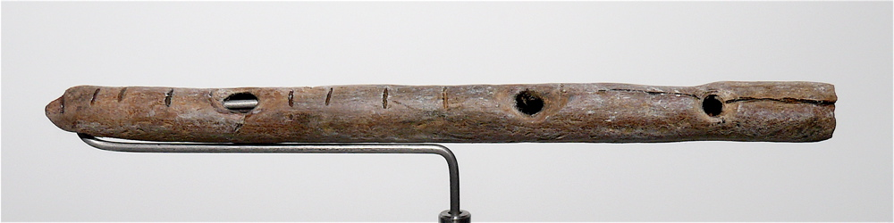

---23/06/22 17:15:30----------------------

Now we are going to talk about the movie Wall-E

Here you have the song that comes after the movie:

https://www.youtube.com/watch?v=hscu7cc1_2Y

You have robot Eve and robot Wall-E, they both go through paintings.
Each of these paintings is coming from a different time:

First you have the paintings on the walls of caves (caves are like big holes in mountains and people lived there) That was some 60000 years ago.
These were painted during the ice age, when half of Europe was under a big block of ice. These are the first examples of big art, paintings that are very big, on the walls of caves - that's where we got culture from, and some people say that language came from this time.

Then at 00:19 you are in painting that is just like the painting on the walls of a pyramid in ancient Egypt (from 5000-2300 years ago)
Egypt was one of the first places with cities and one of the first languages that wrote things down. 
History starts where we can find books what people wrote at the time, everything before that is the time before history - pre-history.

At 00:30 you get into a painting from ancient Greece - you see a lot of ornaments; this is the culture that tells us how to think. They taught us philosophy and mathematics, and critical thinking - that's when you ask questions why things are the way they are.
The Jews were also good at critical thinking - the prophets would ask the kings of Israel questions, and even challenged them - they would tell the king if he did something bad!

at 00:44 you are in a mosaic, that is a picture that is made from very little stones, they like these in ancient Rome (2500-1600 years ago)
Rome built a big empire, and united many people - most countries in Europe say that they come from this time.

at 01:00 comes a painting from China - that's where paper was invented, with very fine lines.

at 1:17 we get back to Europe during the renaissance - that's between six hundred and three hundred years ago in Italy
That's when Europe got back to the tradition of ancient Greece and ancient Rome, and when we learned things like science.
In art they learned about perspective, depth and Humanism - that people are the most important and should come first.

at 1:30 we get into 19th century France - the early impressionist; they taught us to draw what we feel, and not just what we see.

at 1:40 they are in a painting by Monet, many many small dots, like pixels.

at 1:47 they are in a field with sun flowers, just like Van Gogh

at 2:08 in a surrealist painting, where the roots of the tree come all into the boot where Wall-E found the plant/flower.
Surrealist means that this is not real, trees don't have roots like this.
You draw like this if you want to show ideas, not things that exist in the real world.

You see that two robots are going through a journey, as if they learn again what humans learned through their own journey, and all that through the eyes of art.
Art is like a kind of time machine, if you look at both the art and its time.
And that's what we will talk about now...

---

The very first art that we know about is here, it comes from three million years ago!

    

This small stone is a crystal, it looks a bit like a face, and the people of three million years ago added some scratches, to make it look more like a face.
This crystal does not come from the cave, you can find it 30 kilometer away from that cave.
This means they had to take and move the stone all by themselves!

Is that art? The stone could mean a lot to the people who brought it to the cave - they found it far away and had to keep it!

These people were before Humans, they are called Australopithecus - we know very little about this kind of people, we have only the bones of the head, and some tools that they made.
https://simple.wikipedia.org/wiki/Australopithecus

---
Here is some more art from a very long time ago:

This is the "Venus of Berekhat Ram" : a stone figure of a women that was found in Israel, you can see it in the Israel museum in Jerusalem, it is from 280000 years ago!
It had some paint on it, so many scientist think that this was art.

There are many museums in the world, but you need to go to Jerusalem, if you want to see the first art ever!

This was before Humans- but we know much more about the artist! 

This is Homo Erectus scientists found much more than the bones of a head here, we know that he could walk and stand straight on his feet (that's what the name Homo Erectus says) https://simple.wikipedia.org/wiki/Homo_erectus

We think they looked like this

People know that they got out of Africa, they got to Europe and Asia, and even crossed the sea to the island of Java.

You need boats to cross the sea to that Island, it is too hard to swim that distance!

They made very complicated tools like this one:

And this:

It takes hundred of hours to make one like this, you need to plan what to do.
You also need to teach your children how to make these, so they must have known how to talk, somehow.
Maybe they were talking by making signs with their hands, but we don't know exactly.

But we don't know for sure, they all died, and now we have no Homo Erectus to ask...

---

We don't know how Homo Erectus talked to each other.
Some scientist say that they must have had some language - to teach their kids how to make complicated tools.

They didn't have a larynx and a complicated tongue.
A larynx is what you have in your throat, you need that to make sounds for speaking

But you can teach a Gorilla or a Bonobo some sign language. Sign language is what Humans who can't speak use.

Here is an example of American Sign language - that's how you talk with a person who can't speak.

https://www.youtube.com/watch?v=p0ufyoe0URA

Here is Koko - she was a Gorilla who learned human sign language! She could tell us simple stuff.

https://www.youtube.com/watch?v=FqJf1mB5PjQ

Maybe Homo Erectus could talk about more complicated things with his hands! He had a bigger brain and could stand on his feet - that means that his hands were not busy with moving him from one point to the other.

Also Homo Erectus knew how to make fire, that means he could cook his food. Cooked food has more energy in it, so he didn't have to eat plants all day.

---28/06/22 01:45:44----------------------

Now fast forward to the ice age - you already have Humans in Europe - Homo Sapiens, that's us.

At the time of the ice age you had a very large block of ice. This block of ice was covering half of Europe. The weather was much colder than now. The ice age was from 60.000 years ago until 10.000 years ago.

In Germany you can sometimes see some very big stones near Berlin, where you don't have any mountains. These stones got there because this big block of ice moved them from far away!

Now a lot of things happened during the ice age, things were very cold and people had to fight hard to survive. At this time they make tools that get much more complicated. 

You can use these to catch fish. They also had bows and arrows!

People were hunting big animals, like Bison, Reindeer and stone age Rhinos with a big horn. You had to take these stones and glue them onto a stick, then some of these spears could be used for throwing, with some of them you can't do that - you take that spear and run up to the animal and stick it into it.

Some 30.000 year ago they also made music! This is a flute made out of some piece of bone  

Now some scientists say that that that's the time when people learned how to speak!

But the biggest thing that archaeologists found are drawings in caves - a cave is a hole in a mountain. Some of the drawings are from 40.000 years ago! You can find the paintings in some caves in Spain and France. You can also see paintings in the Sahara dessert - that was not a desert at the time, it had grass and lots of animals were living there.

Look at this painting of a bison from the Altamira cave in Spain  (from some 12000 years ago)

You see they knew about perspective - look at the legs, the leg that is near to us is drawn stronger.
And it's a three dimensional painting - some parts are near to us, some are further away.

How did they do it? They used occre color - you take some special stone/clay that has some iron in it - that's why it is red. You need to turn it into dust and add some fat to it - the fat makes the color stick to the wall.
You can also make a paint that is made from charcoal - that is wood after you burn it, then it turns black and you can make a some black paint out of it.

Then they took some paint and blew the paint onto the wall by moving the air with their mouths. As if they breathe life into the painting! That's not just some wall, it's the ceiling - above their heads. So they had to use lamps to put some light into the cave.

Why did they do these paintings? We don't know for sure, but we are guessing. There is a science called anthropology - scientists go to far away places like the amazon and Australia and Africa, some groups of people live there as if in the stone age - they did not have any contact with anyone else. The anthropologists live with them, learn their language and their culture. This way we can guess what the people were thinking some 30000 years ago.

Archaeologists dig up stuff, and they can also tell from what time it was. They use different tricks to do that.

There is also another direction - we think about the art, how does art work? What does it mean? How does it move us?

Linguists think about language, and where it came from and how language is working. That means they also think about the way we think.

You see that this is a big puzzle, and you get ideas from many areas of study. More about this in the next lesson.

