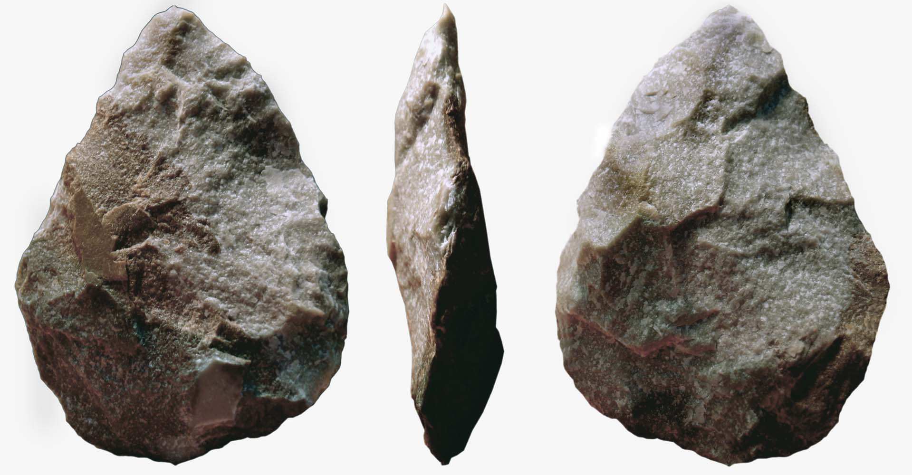
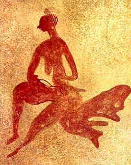

---23/06/22 17:15:30----------------------

Now we are going to talk about the movie Wall-E

Here you have the song that comes after the movie:

https://www.youtube.com/watch?v=hscu7cc1_2Y

You have robot Eve and robot Wall-E, they both go through paintings.
Each of these paintings is coming from a different time:

First you have the paintings on the walls of caves (caves are like big holes in mountains and people lived there) That was some 60000 years ago.
These were painted during the ice age, when half of Europe was under a big block of ice. These are the first examples of big art, paintings that are very big, on the walls of caves - that's where we got culture from, and some people say that language came from this time.

Then at 00:19 you are in painting that is just like the painting on the walls of a pyramid in ancient Egypt (from 5000-2300 years ago)
Egypt was one of the first places with cities and one of the first languages that wrote things down. 
History starts where we can find books what people wrote at the time, everything before that is the time before history - pre-history.

At 00:30 you get into a painting from ancient Greece - you see a lot of ornaments; this is the culture that tells us how to think. They taught us philosophy and mathematics, and critical thinking - that's when you ask questions why things are the way they are.
The Jews were also good at critical thinking - the prophets would ask the kings of Israel questions, and even challenged them - they would tell the king if he did something bad!

at 00:44 you are in a mosaic, that is a picture that is made from very little stones, they like these in ancient Rome (2500-1600 years ago)
Rome built a big empire, and united many people - most countries in Europe say that they come from this time.

at 01:00 comes a painting from China, the picture has very fine lines. The picture is drawn on paper and people in China invented paper.

at 1:17 we get back to Europe during the renaissance - that's between six hundred and three hundred years ago in Italy.
That's when Europe got back to the tradition of ancient Greece and ancient Rome, and when we learned about new things, like science.
Artists learned about perspective, depth and Humanism - that people are the most important and should come first.

at 1:30 we get into 19th century France - the early impressionist; they taught us to draw what we feel, and not just what we see.

at 1:40 they are in a painting by Monet, many many small dots, like pixels.

at 1:47 they are in a field with sun flowers, just like Van Gogh

at 2:08 in a surrealist painting, where the roots of the tree come all into the boot where Wall-E found the plant/flower.
Surrealist means that this is not real, trees don't have roots like this.
You draw like this if you want to show ideas, not things that exist in the real world.

You see that two robots are going through a journey, as if they learn again what humans learned through their own journey, and all that through the eyes of art.
Art is like a kind of time machine, if you look at both the art and its time.
And that's what we will talk about now...

---

The very first art that we know about is here, it comes from three million years ago!

    

This small stone is a crystal, it looks a bit like a face, and the people of three million years ago added some scratches, to make it look more like a face.
This crystal was found in a cave. But it does not come from that cave. You can find crystals like that, but they are some 30 kilometer away.
This means they had to take and move the stone all by themselves!

Is that art? The stone could mean a lot to the people who brought it to the cave - they found it far away and had to keep it!

These people were before Humans, they are called Australopithecus - we know very little about this kind of people, we have only the bones of the head, and some tools that they made.
https://simple.wikipedia.org/wiki/Australopithecus

---
Here is some more art from a very long time ago:

This is the "Venus of Berekhat Ram" : a stone figure of a women that was found in Israel, you can see it in the Israel museum in Jerusalem, it is from 280000 years ago!
It had some paint on it, so many scientist think that this was art.

There are many museums in the world, but you need to go to Jerusalem, if you want to see the first art ever!


This was before Humans- but we know much more about the artist! 

This is Homo Erectus scientists found much more than the bones of a head here, we know that he could walk and stand straight on his feet (that's what the name Homo Erectus says) https://simple.wikipedia.org/wiki/Homo_erectus

We think they looked like this


People know that they got out of Africa, they got to Europe and Asia, and even crossed the sea to the island of Java.

You need boats to cross the sea to that Island, it is too hard to swim that distance!

They made very complicated tools like this one:



And this:


It takes hundred of hours to make one like this, you need to plan what to do.
You also need to teach your children how to make these, so they must have known how to talk, somehow.
Maybe they were talking by making signs with their hands, but we don't know exactly.

But we don't know for sure, they all died, and now we have no Homo Erectus to ask...

---

We don't know how Homo Erectus talked to each other.
Some scientist say that they must have had some language - to teach their kids how to make complicated tools.

They didn't have a larynx and a complicated tongue.
A larynx is what you have in your throat, you need that to make sounds for speaking


But you can teach a Gorilla or a Bonobo some sign language. Sign language is what Humans who can't speak use.

Here is an example of American Sign language - that's how you talk with a person who can't speak.

https://www.youtube.com/watch?v=p0ufyoe0URA

Here is Koko - she was a Gorilla who learned human sign language! She could tell us simple stuff.

https://www.youtube.com/watch?v=FqJf1mB5PjQ

Maybe Homo Erectus could talk about more complicated things with his hands! He had a bigger brain and could stand on his feet - that means that his hands were not busy with moving him from one point to the other.

Also Homo Erectus knew how to make fire, that means he could cook his food. Cooked food has more energy in it, so he didn't have to eat plants all day.


---28/06/22 01:45:44----------------------

Now fast forward to the ice age - you already have Humans in Europe - Homo Sapiens, that's us.

At the time of the ice age you had a very large block of ice. This block of ice was covering half of Europe. The weather was much colder than now. The ice age was from 60.000 years ago until 10.000 years ago.

In Germany you can sometimes see some very big stones, in a place where you don't have any mountains. These big stones are near Berlin. They got there because this big block of ice moved the stones from far far away!


Now a lot of things happened during the ice age, things were very cold and people had to fight hard to survive. At this time they make tools that get much more complicated. 


You can use these to catch fish. They also had bows and arrows!


People were hunting big animals, like Bison, Reindeer and stone age Rhinos with a big horn. You had to take these stones and glue them onto a stick, then some of these spears could be used for throwing, with some of them you can't do that - you take that spear and run up to the animal and stick it into it.

Some 30.000 year ago they also made music! This is a flute made out of some piece of bone  


And 20.000 years ago we got dogs! Once there were only wild wolfs, no dogs. Dogs were wolfs, who got used to living with people!

Now some scientists say that that that's the time when people learned how to speak!

But the biggest thing that archaeologists found are drawings in caves - a cave is a hole in a mountain. Some of the drawings are from 40.000 years ago! You can find the paintings in some caves in Spain and France. You can also see paintings in the Sahara dessert - that was not a desert at the time, it had grass and lots of animals were living there.

Look at this painting of a bison from the Altamira cave in Spain  (from 14000 years ago)


You see they knew about perspective - look at the legs, the leg that is near to us is drawn stronger.
And it's a three dimensional painting - some parts are near to us, some are further away.

How did they do it? They used ochre color - you take some special stone/clay that has some iron in it - that's why it is red. You need to turn it into dust and add some fat to it - the fat makes the color stick to the wall.
You can also make a paint that is made from charcoal - that is wood after you burn it, then it turns black and you can make a some black paint out of it.

Then they took some paint and blew the paint onto the wall by moving the air with their mouths. As if they breathe life into the painting! That's not just some wall, it's the ceiling - above their heads. So they had to use lamps to put some light into the cave.

Why did they do these paintings? We don't know for sure, but we are guessing. There is a science called anthropology - scientists go to far away places like the amazon and Australia and Africa, some groups of people live there as if in the stone age - they did not have any contact with anyone else. The anthropologists live with them, learn their language and their culture. This way we can guess what the people were thinking some 30000 years ago.

Archaeologists dig up stuff, and they can also tell from what time it was. They use different tricks to do that.

There is also another direction - we think about the art, how does art work? What does it mean? How does it move us?

Linguists think about language, and where it came from and how language is working. That means they also think about the way we think.

You see that this is a big puzzle, and you get ideas from many areas of study. More about this in the next lesson.

---29/06/22 05:01:30----------------------

here someone made art with a cup of coffee and some milk foam.


What has that got to do with the history of art? The first cave paintings appear 40.000 years ago, but Homo Sapiens already exists for some two or three hundred thousand years, does it mean that art was a very late invention?

We don't know, it can be that people had some art before, just that we don't know about it. The cats on top of the coffee will not survive for a hundred thousand years, maybe people did some other art earlier, like painting on their own bodies or painting on baskets.

We don't know for sure, but they found ochre paint that comes from earlier than 285.000 years ago, it is much older than the cave paintings! What do you do with paint? Something that has to do with art!

-----

Now what is art? You draw something, it looks like it is real, but the painting is not real.


This is a painting from 1928 by Rene Margarite. The text on the painting is in French, it says: "this is not a pipe".
People asked the painter: but we can see a pipe on the painting - this is a pipe!
Rene answered: if it is a pipe, then take it and smoke it!

You see that art is a bit different, or very different from a real thing. It is a symbol.
Art is about the artist talking to the people who see the painting - the artist wants to tell us something.
The artist can talk about something real, but also about his feelings. The artist always wants to make us feel something, when we look at his art.
Art is a tool, that is used by the artist to talk with us!

The cats in the coffee cup tell us: this is cute! Or the artists wants to say "i put in a lot of work in this cup, you want to drink the coffee, but how can you take it and destroy my art?" or maybe it means something else...

Pablo Picasso said that "art is a lie that helps the artist to tell the truth" - the picture is not the same as the real thing, often the artist is using tricks that help him to tell us something, but these tricks move the painting away from the real thing.

People get very exited about the old paintings on the caves - it tells us that people from 40.000 years ago thought abstract ideas - that is about things that you can't touch or use as tools. That means that they thought just like us! 

----

Dolev asked me about the scratch marks on one of the tools:

Thats a good question. Yesterday I saw something on youtube. Genevieve von Petzinger is looking at symbols drawn in caves, she made a catalog of all symbols that she found. https://www.youtube.com/watch?v=hJnEQCMA5Sg


She says that the sign with the dots is very often found!

maybe even possible that these scratches count something, or that it is for beauty.

Geneve became a big star in anthropology for asking your question!

No one was bothering with the signs, everyone was cool with the paintings. Now they say that Genevieve is a big star, because some six and half million people saw her talk on youtube! She was asking just the same questions as you do!


---01/07/22 05:24:13----------------------

Back to the cave paintings, you can see a many drawings of animals, they are drawing a lot of details.
This means they are naturalistic pictures - they try to look like they look in nature.

Like the Bisons in Altamira cave - they are sometimes drawing around cracks in the stones.


Or in Chaveaux cave


 

Look at the horns of the animal in the last picture - that's a trick.
You see the animal from the side, but the artist is drawing two horns, you would see only one horn from this perspective!

Also see this one from Lascaux cave


Like with Mickey mouse - you would not see both ears from the side. The same trick here:


People are often drawn in the same picture, but in less details. This means they are often more abstract.

Also you have a lot of signs, maybe they stand in for people, 


Maybe they wanted to draw the soul of the animal, maybe they had a fascination for the strength of animals and people were less interesting.
Maybe their religion would not allow drawing people, we have that in Judaism.

That may be like a smiley. I would be afraid to see a real person with a face like this


But we know what it says, so we are not afraid...

You also have a figure of a person who as if he is a lion. Maybe they already had abstract thought back 30.000 years ago.
Maybe this is a kind of priest, a Shaman.


People were thinking in concepts, if they combined a person who is just like them and a lion - the king of the animals. Maybe that's their idea of superman...

Most of the stuff here comes from a video lecture, they have a university course on the history of art on youtube. Here is one of the first lectures

https://www.youtube.com/watch?v=P_tkKoXDfdg&list=PLjxfpwtKvIlmbzrwkUuhVRI2X2V4t5QWE&index=3

There are lots of ideas on the meaning of all this. I think that I would have to read more about the subject, before I tell you stuff about the meaning of it.

In science you would take many details and look at them together:

- what were the people eating? You can take a place where they put their garbage and look at the bones of the animals, they can tell the kind of animals from the bones!
- Are they drawing animals that they eat?
- You can think about other cultures that are in far away places, like Africa or the Amazonas, and compare what they are doing.
- You can compare pictures from different places and different times, and see how they changed through time.
- what kind of tools are people using? Sometimes you can find differences between the stone tools - tools from east Africa are a little bit different from the tools that they find in west Africa, so they had different cultures, and we see that from the difference in the stone tools! A lot later people start to make pots/pottery (that was just some seven thousand years ago). Scientist study the types of pots, the drawings that were made on the pots - all this gives you a lot of clues on the culture that people had, during the same time as they find other things, at the same spot!
- Lots of possible ways to search for answers.


https://www.youtube.com/watch?v=ns3YRpeeGwI
Like in the movie AI, you have aliens that study a robot made by Humans, the Humans are no longer there, so they want to find out about our culture.
Then the Aliens all come together and stand in a circle, each one knows a different part of the puzzle, and they tell their part of the big picture to all the other guys.

That's their kind of science, just like ours...

------

My daughter Dolev added about the sign language of Koko the Gorilla: That's right, but Koko doesn't know how to create new words, she only knows how to use words that she learned.
The closest she got to creating a new word was to say bird water - while talking about a bird in a water.
Also she doesn't use a grammar to combine the words.

I answered:
That is right. In the English language that's a big error. But there are other languages where the order of words is not important. But you are right, these languages have a grammar too, just that it looks different. Here is wikipedia talking about the order of word. https://en.wikipedia.org/wiki/Word_order
There are different rules for language. Grammar is a way of taking words and putting them together.

In the English language you say: "She loves him"
- the word "She" is the Subject - that is the word for a person or a thing that is doing something
- the word "loves" is a Verb, that is a word that describes an action, something that we do.
- the word "him" is an  Object. That is a word that tells who gets the action, who is acted upon.
That means that English is an Subject-Verb-Object language, because that is the order that words appear in.

In Japanese or Mongolian you would say "She him loves" - that is a subject-object-verb language

But there are languages, where the order of words does not matter, but they have other rules of grammar, rules of putting words together!
You have a free word order in the Russian language, and other languages that are similar to Russian.
In these languages you have more kinds of word forms, this helps you to find matching words, and this helps you to figure out the meaning.

Language is very important, because it also tells us about the way that we think.


---03/07/22 07:18:28----------------------

Before we study language in more detail, what is so special about language?

What can we do that animals can't do? Lets first see what animals can do:

- There are some monkeys on Koshima Island, in Japan The mother monkeys taught their kids to wash sweet potatoes in the sea water. Sea water is salty, and the potatoes taste better that way! Teaching your kids how to do stuff is culture, some animals have their own culture!  https://www.youtube.com/watch?v=gz8FlSKJ2JE&t=120s

- Chimpanzees make tools, some groups of Chimps can make fifteen tools, they even can sharpen a stick and hunt with the stick

- lots of animals can communicate somehow. When a craw dies, other craws come together and are very sorry about what happened. They seem to be talking with each other and try to understand what happened. 

Also look at this craw, how it is throwing little stones into the bottle, the stones push the water out of the bottle so that the craw can drink it! https://www.youtube.com/watch?v=NGaUM_OngaY

- you saw Koko the Gorilla, talking with her hands while making signs, the same language as used by blind people.

- they say that elephants can recognize themselves. When you put an Asian elephant in front of a mirror, and he has some spot on his face, now the elephant cleans herself up, that means she knows that she is looking at an image of herself! Scientist say that she is aware of herself (though I am not sure why they think that)

here is a nice video - the elephant is looking at herself in the mirror, it takes some time, but then she understand that she is looking at herself! https://www.youtube.com/watch?v=NygmdjerkLQ

- look at how Suda the Elephant is painting pictures with her trunk! https://www.youtube.com/watch?v=7XOl48ssdyo 

But there are limits. Animals don't know about symbols, or abstract thought. It would be hard for Koko to talk about things that happened in the past, for example. Also the sentences that Koko was making were very very simple.

We need complex language to talk about more complex stuff, and we can do that; That's what makes us special! 

(I learned most of the stuff here from a book "Are we smart enough to know how smart animals are?” by Frans De Waal)

---

Another form of animal communication. Liraz gave some cat food to Kitty, the street cat. Then she brought all her relatives as well - all the kitties look similar. They all want to eat cat food!

One cat is waking me up at six a clock in the morning, with a loud cry of Miiaaau, she says that again and again and she is loud, in a screechy voice.

Another one is waiting silently, but then she is making noise by scratching the window.

A third one is also saying Miau, but only once.

I can tell who it is, by the way that they talk to me!

Here they are (I have a deal with them - they get some cat food, but the cats need to get rid of any mice, or other animals...)


---04/07/22 12:21:56----------------------


Now some more about language, now that we know how special it is!

Grammar is a set of rules that helps with making a sentence from words; 
Last lesson we saw some rules, like Subject-Verb-Object, in English we say "She loves him".
"she him loves" is a wrong sentence in English, but you could have the same order of words in Japanese.

A grammar is a set of rules for putting words together.

Lets make a grammar, first lets talk about how a rule looks like:

Each of these rules is a rewrite rule:
A rewrite rules - you have one or more symbols to to the right of the := sign, if these symbols appear in the text in the same order, then they are rewritten into only one symbol - the symbol that stands to the left of the := sign.


```
    Sentence := Noun-phrase Verb-phrase

    Noun-phrase := Noun

    Noun-phrase := Determiner Noun
```


Also there are two rules with Noun-phrase on the left sign, that means that one of them can apply - depending on if you have a single Noun in the text, or a pair of Determiner and Noun.


Next there are rules for words. It is used when you have any one of the words that stand to the right of the := sign, each possible choice of words is standing between the | sign.

```
    Noun := I | cat | spaghetti | home | computer

    Determiner := my | his | her

    Verb := go | eat | swim | jump | drink

```

Now look like these rules are used with the following sentences. The sentence "I go home".

```

                              Sentence
                              /    \
                      Noun-phrase  Verb-phrase
                          /       /     \
                        Noun    Verb    Noun
                        |        |        |
                        I        go      home
```

You get something like a tree, when you apply all of the rules!

You get something very similar for the next sentence 

```
                              Sentence
                              /    \
                      Noun-phrase  Verb-phrase
                          /       /     \
                        Noun    Verb    Noun
                        |        |        |
                        I        eat      spaghetti
```


Now look at the following sentence "my cat eats spaghetti"

```
                                     Sentence
                                  /           \
                                /               \
                          Noun-phrase         Verb-phrase
                          /        \          /       \
                       Determiner   Noun     Verb     Noun
                        |           |        |        |
                        my         cat      eats    spaghetti
```
 
Words that are related have a small tree of their own, like "my cat" and "eats spaghetti"

Here you see such a small tree.

```
                         Noun-phrase      
                          /        \         
                       Determiner   Noun     
                        |           |       
                        my         cat   
```


The word "my" and "spaghetti" are not closely related, but you see a connection - to connect them you need to go up until the top of the tree!

The tree for the grammar is showing you two things:
    - the order of the words
    - the order of thought: related words are in a small tree, close to each other, they explain one another!

People thought that this is a big deal, and they built a big theory around this!

The big deal is that you can describe a lot of sentences this way, even sentences that you have never heard before! 
You say that a language is 'generative' - if you can use it to create all kinds of new sentences, you can even make up sentences that don't make sense, but they are by the rules. "my spaghetti drink computer" - doesn't make sense, but these rules allow it!


A second question is: how do most children manage to learn all the rules of language so quickly, in the first few years of their life?

But we leave that for the next lesson....

One interesting thing: a grammar like this is always used to describe a programming language, that is a language used to write computer programs.
The grammar helps us to create a language used for talking to the computer!


---04/07/22 22:35:39----------------------

Children learn language when they are very young. 

Noam Chomsky is a linguist - a scientist who studies language. He says that we learn language very fast - much faster than we should learn it.
He says that some kind of general grammar rules are built right into our brains, and that this explains why we are learning so fast.

He also says that language developed suddenly, as a kind of mutation. 
A friend of mine, who is very religious actually likes this - he says that this similar to the Bible and how God created man in seven days!
(all that despite the fact that Noam Chomsky doesn't believe in God at all)
What i learn from this is that there are very different kind of ways on how to look at things!

Other linguist don't agree, so they fight it out among themselves.

You can learn some more about Noam Chomsky and his ideas here:  https://www.youtube.com/watch?v=Q-B_ONJIEcE

There are many other linguists with different ideas, and we can also learn what they say, if you are interested...

Another detail: they say it shows that we have some built-in ability for learning language.
Nicaraguan sign language https://en.wikipedia.org/wiki/Nicaraguan_Sign_Language

Nicaragua is a country; it had a big group of people who can't talk, who are deaf. The deaf people made up a sign language of their own, without anyone teaching them, all by themselves!
And this language has all the features of a real language, just like all the other six thousand languages in the world!

---

Dolev asked a question!  "If that is so then why are so many languages different in the way that you can arrange words in order to make an understandable sentence?"

That is a wonderful question! I am glad you asked!

Chomsky says there is a 'surface grammar' - a grammar for each language, but then there is a more abstract 'deep structure grammar' that is universal, common to all languages.
The problem is that no one could find this deep structure grammar.

Then he changed it: he says what makes up the deep structure grammar are tricks for learning grammar. There is a rule for "merge" -  building a substitution rule like 

Sentence := Noun-phrase Verb-phrase 

And there is a rule for recursion - recursion means rules for building sentences that contain other sentences. like "Dolev said that her friends said that the sun is rising".

But then this also has other problems: there should be some more common mechanism in the brain like "universal grammar", something that could be used for other things like vision, general problem solving, but there isn't.
Also as I said, all these substitution rules don't work for languages with a free word order, like Russian (there are other structural grammars that work better here, like dependency grammars)

Still, people like what Chomsky did - he asked a lot of good questions like:

- how do children learn language?
- how is syntax represented in the brain?
- what things are common between languages?


---05/07/22 00:35:13----------------------

Now back to art: 

Something important happened some twelve thousand years ago. The ice age came to an end, it became warmer.

Now all the action happened in the sahara dessert - at that time it wasn't a dessert at all! There was grass everywhere, they had lots of animals there.

We know it from the paintings that people left on the walls of rocks (they also find old bones of elephant, rhinos, gazelles, giraffes - in places where there is a desert)


These paintings are now standing in the middle of the desert. There was no desert anywhere near the place, at the time when they were drawn!

At that same time something big happens: people start to do something new:

People start to have herds of animals, like sheep and goats, just like the forefathers of Israel -  Abraham, Isaac, and Jacob!
Now people had more time, as they didn't have to hunt and gather all day! Hunting and gathering takes up a lot of time, so you have little time for anything else.

You see interesting things in the paintings - there are more humans around, and they draw them in more detail!

This woman is sitting or dancing  -  painting from a famous site, Tassili n'Ajjer, in the land of Algieria.

It takes a long time until people start to plant their food, that is called agriculture. It takes some more years, you only get there three to five thousand years after that!

Something very happens in art, people start to build big monuments made out of big stones, maybe these are temples? 
(this kind of art is alled Megalithic - Mega means big, lithic means a thing made from stone)

Göbekli Tepe in Turkey  from 10.000 years ago!

In Israel we have Atlit-yam, that's place that is now under the sea, near Haifa - also from some 9000 years ago 


You have lots of interesting old things in Israel. People had to get to Israel, if they want to go in and out of Africa! We were a big cross road!
The weather is also great - it is not very hot and not very cold!

Stonhenge, in Great Britain - the earliest stones are from five thousand years ago, it took them a thousand years to build it 


Why did people do all that? Scientist think that this is how we got society: once upon a time people lived in small groups, very small bands of people, or villages with up to a hundred people in it. Now you can trust everyone in a small group - you know each other well, some of the people are your relatives.
Trust is that you can believe what they say, you don't have to think all the time that they want to cheat you.

Later the groups get bigger, and everyone is doing some special kind of work: some people are got at making clothes, so they make clothes all day.
Some people are got at herding sheep, so that's what they do all day. These people have to exchange things, they need to trade what they got!
At this moment trust becomes important, there is a big problem, if you can't trust anybody. 
Try to be afraid of everybody - now life is very hard if you do that, cooperation becomes impossible, if you do that!

Now people need some common ideas, a common religion. And they do big projects together to build these temples - in the process they learn to trust each other.
So maybe this process of building art created our first societies! You see that art is very important...

It's not just a nice painting - people really put a lot of meaning into art!

---06/07/22 04:46:33----------------------

Remember we talked about how to grow food? 

You need a lot of people to build these big monuments, because only lots of people working together can change the shape of these big stones and move them.
It needs a group of hundreds of people who all live together.
You need some specialists for carving the images on the blocks - specialists are people who are good at doing a thing. That's because they do it every day.

Now scientists thought a group of hunters and gatherers can't do this, because they can't get enough food to feed this big group of people!
They would spend all of the day with finding food!
It turns out that things are complicated.

Remember Göbekli Tepe in Turkey 

 from 10.000 years ago?

Scientists looked at the garbage from that place, and it turns out that they were eating gazelles. Gazelles are wild animals, they don't live in herds.
You need to hunt a gazelle if you want to eat it, so these people did not have herds of gazelles.


A gazelle likes to jump around, and people can't keep them in herds, like sheep. The gazelles don't go were we want to go, they go to some other place.

What happened? You can do a lot to make it easier for the gazelles to grow, so that it is easier to hunt them.
        - you can kill all the animals that eat gazelles, there will be more gazelles for hunting, if the predators don't eat them
        - you can burn the wild grass in the steppe. The next year it will be easier for the grass to grow, and there will be more grass. This means more food for gazelles. This way you get more gazelles for hunting (Indians in America used to did this, so that they had more Bisons for hunting - you see, that needs a lot of planning, people were very clever, for quite some time!)

But then this explanation also has a problem: you can't do these tricks for a long time, If you burn the steppe for several times, then the land becomes tired, and the grass will not grow again. Erosion starts - that's when the wind is blowing the soil away, and you get a lot of dust. That's how big steppes can turn into deserts.

In the end it is hard to know for sure what happened. We can only make guesses. We don't know the exact history of the people who lived there.

One of the guesses is that they needed these very big art project in order to build a society - a society is a big group with thousands of people. Maybe that's the way to bring in lot of people and unite them for the project, you see these big buildings in lots of a places, all over the world, so maybe this is a stage that people had to go through...

You had these big art project in a lot of places, like the Easter Island - in the middle of the Pacific ocean!


Easter island is very far away in the pacific ocean, if you have a spacecraft, and you need to get rid of it, then you fly it to point Nemo - that's a point that is very far way from any land. This way the spacecraft will not fall on the head of anybody. Here is a map with point Nemo and Easter Island.


Here is an old Soviet/Russian space station called "Mir" - it is burning, while the pieces of the space station are falling on their way to point Nemo.


---

But later there came another big change: some five thousand years ago people learned how to write, they learned how to do that in both Egypt and in Mesopotamia (that is the land in Iraq).  That is the start of history: from that moment we can look at texts that were written by the people who lived at the time!
Before writing we can't know anything for sure, all we can do is make fancy guesses...

<!--
---06/07/22 15:13:11----------------------

Some of the things that people built ten thousand years ago are really big. Sometimes you can hear other people, who say that these had to be build by aliens from outer space.

But the scientists say that this is bullshit.

You can get a lot done by working together, even with very simple tools!

I can give you a challenge to check this out (no, you don't have to move heavy stones...)

Eliran likes to look at maps, you could make a game that is an electronic map! A map, you can click on places, and it does ... whatever you want it to do...

There is a very simple programming language called "Scratch" - you can learn it on youtube: https://www.youtube.com/watch?v=uv8mbL-MC58

You need to think about what kind of map you want to make,

You would have to make some plan: decide what it will do - what you can click on, what kind of story it would tell.

Here you could learn about different kinds of maps and about different kind of places in the process.

You can even teach Elirani how to change this game, it's not very complicated, you can tell the program to work in Hebrew!

One tip (if you decide if its a good idea) : You can write down what you want to do. I sometimes make some projects like this, and I try to write such things down.

This way I don't forget what I am doing.

Writing down is really a kind of super power! 

Not many people know that...

I can help you, if you have any questions!

What do you think?
//-->

---07/07/22 05:47:41----------------------


Now lots of things happen between 12000 years ago until 5000 years ago (that's the time when we get the big civilizations of Egypt and Mesopotamia - the land in modern Iraq)

Lots of things happen during this time:

The city of [Çatalhöyük](https://en.wikipedia.org/wiki/%C3%87atalh%C3%B6y%C3%BCk) in Turkey, it is from 9500 years ago, and some 5000 people lived in houses, that's a big group of people! The houses were built very close to each other, the wall of one house would also be the wall of the next house. But they sometimes had squares of empty space between the houses, sometimes they had big holes between houses - they would put their garbage in these holes. People moved from the roof of one house to the roof of the next house - they didn't have streets between the houses.

That's what they found 


They think it looked like this 


Usually a family lived in a house, the houses were all of equal size, that would mean that people were more or less equal - they didn't have very big houses for the rich people! That's a very strange thing - you don't have that very often, this is very unusual!

People also started with agriculture - growing plants for eating, they had rooms for storing wheat, barley and fruit. But they also held sheep and some of them were hunting.

You didn't have big city walls around this city for protection. Maybe the way they built the houses was a kind of protection - you would have to fight for each house, they were built very close to each other.

Also each family was making their own tools, they did not have specialists who would only do one kind of tool. More on that later.

Do you remember the story of Atlantis? The Greek philosopher Plato told a story of a city on an Island that was called Atlantis, the island later sank in the sea. Plato told, that they didn't have rich or poor people in Atlantis, so maybe that's a bit like the city of Çatalhöyük.

Dolev is asking "Maybe they were just communists?"

Answer: Maybe, but in the Soviet Union a director of a factory had a bigger house than a factory worker.
Another thing: in old societies they were bringing presents to the graves, if a person dies, then he got presents, for the afterlife. But in Çatalhöyük they did not find much of a difference with these presents.
You also don't have much of a difference in other societies - mostly simple societies in far away places.
Maybe Çatalhöyük was somewhere in between - it was still a very simple society, but things were about to get much more complicated in the future.
In English they say "strange things happen at sea"
this means that things can get complicated - if you look at something specific.

---

Another place: the towers of Jericho from 10000 years ago.   Jericho is a town near the dead sea - it is the place where people are living for a very long time, the oldest town on earth!

The [tower](https://en.wikipedia.org/wiki/Tower_of_Jericho) was 8.5 meter high, when it was built. But then you had more and more soil forming around the place, so that it lies deep under the earth.

You need a hundred people building that, they would all have to spend a hundred days to build that. So they must to have some kind of organization: someone needs to prepare the food, others need to gather that food and store it somewhere. Lots of action!

Why would they build this wall? Usually you have that to defend against enemies, but we don't know for sure - they didn't find any enemies around the place.
You can also use the tower and the walls as protection against floods - that is when the water is rising high.
Some scientist say that big city walls are not only built against enemies - you need them to keep your own people from running away! 
Or maybe it had something to do with astronomy - we can only guess, they didn't know how to write things down ten thousand years ago.

---

Another big change: people start to make pottery, that is somewhere like 8500 years ago. 

Here is one of the first pots, they found it near Kibbutz Shaar Hagolan in Israel, it is some 8400 years old, so it is a very old pot!


That is a big change: now from that moment archaeologists start to find pots and broken pieces of pots - they find these in a lot of places. There are a lot of ways to make pots, and people also make nice decorations and drawings on the pots, each culture has its own way of making pots, and you find the pieces of pots in lots of archaeological sites!

You can use these peaces of pots to guess about the date of what you found - when it happened. If you find stuff with the same pieces of pots, then they are from the same time!

You can also say, if these people were trading stuff with other people. Sometimes you can find a pot from a different culture, that shows what kind of trade was going on!

Also pottery may be a sign of specialization - some people start to make pots all day, others make tools, there may be other professions as well.
The pottery is getting more complicated, and you need people who really know how to do this stuff, you can't make all of your tools, as before.

All this stuff helps you to find layers: new soil/earth is forming, and old stuff is buried under the earth (like at Jericho, where the big towers got buried in the ground).
Now you can find different layers - different areas that have common style of pottery. This way you can group the stuff that you find by time!
Troy is a town in Turkey, you remember the story of the Troyan horse? That's the place!


They found some ten different layers there, each one is coming from a different time period and a different kind of culture.
Things get very complicated, if you have that many layers.

Like with the movie Shrek - here Shrek is explaining that he is a very complicated person, because he is having many layers

https://www.youtube.com/watch?v=-FtCTW2rVFM&t=37s


---14/07/22 03:58:45----------------------

There are a lot of ways to make a pot, each different way will give you a different kind of pot, you can tell a lot by looking at the pot and the way it was made:

This is how pottery is made, wikipedia tells us a lot about pottery in ancient Egypt: https://en.wikipedia.org/wiki/Ancient_Egyptian_pottery

- First you have to find the clay - that's the stuff used to make pots; in Egypt you can do that by two ways 
    - get the clay from the Nile river; the river moves the stuff from the mountains down to the sea.
      The river has much more water in the spring, that's when the water is spilling over into the land around the river, a lot of land is covered with water.
      You can then find the clay, when the water gets back into the river.
      Nile clay was used for simple stuff that simple people bought for themselves.
      Firing will turn this clay into a dark red or brown pot - here is a pot made out of nile clay

        

    - you can dig up the clay from the earth, this is Marl clay - you have to carry the clay for some distance, it was used for very expensive pots,
      Firing will turn this clay into a white or cream colored pot, here is a pot made out of marl clay

        

- Next step: you need to prepare the clay, you can do this in two ways:
    - make the clay dry, break the clay into very small pieces and remove small stones and dirt with a sift.
    - put the clay in water, now you have to wait and remove the dirty water, do so again and again.

    later you need to add some stuff, to make it easier to form the clay. This is called stuff is called temper - it can be made out of bones, out of coal, out of sandstone now comes an important part: you need to remove all the air bubbles from that block before using the clay. You can get an explosion without this step - the air bubbles will grow when heated, so that your pot will explode in the fire! You have to be very careful, also this step takes a lot of time, knead the clay again and again.


- next you need to form the pot from the wet clay, again lots of possibilities.
    - Form it by hand. If you make a pot on your own then you will most likely use this method.  

even today you have people who work like this. This picture is not from long ago, this is near the Amazon river in south America.

You can do better, welcome to the potter wheel!
    - use a rotating base, like this one, this is a very early method, it was even used before the time of the Pharaos, some six thousand years ago!  
    - or you can use a slow potter wheel. You need one hand to turn the wheel, and you have to use your other hand to form the clay.  

This potter wheel is an important tool, you can use that in a small factory. In a factory each person does only a single small part of the process, one person is preparing the clay, the other is forming and so on. You can make many many pots this way, when many people are working togather like this, this is called mass production. They had it since the Old Kingdom of Egypt - some 4600 years ago, when the pyramids where built! 

The fast potter wheel, you can turn it with your feet and you both hands to form the clay, they had this sine the new kingdom of Egypt - some 3500 years ago, it took a thousand years to come up with this invention.      

- Next stage: the clay is still wet, it has lots of water in it. You can now decorate the pot, scratch something into the clay 

  Now is the time when you can also polish the pot and put on stuff to make it shine 

  Another detail: the base of the pot is being finished - the base is a tricky part, it needs a lot of work - even at this stage.

- Next stage: Drying: You can't put it into the fire right now, the clay still has lots of water, the fire would turn the water into steam, and your pot would explode.
  Now you need to be careful - if the clay dries too much, then the pot will shrink. In the summer you have to put it into the shade, for several days.

- Next stage: Firing: put the pot into the fire, so that it gets hard. But you need to turn on the heat slowly - there is still some water in the clay that needs to turn into steam. Again there are several methods to fire the pottery:
    - an open fire, put some wood into the pot,  

        - even used today, in Mali.

        Pots made like this often have a black rim on the top 
        Still, there are lots of trick that can make a big different - more details: https://ancientpottery.how/open-fire-pottery/
    - larger scale production: a Kiln - here you can control how much oxygen gets near the pot, while it is hot. This can be used to change the color of the pot.
          You also have more control on how the fire is burning, this gives you pots of better quality. You can know that each pot got the same amount of heat.

        

      This tool is also a sign of mass production in factories - a very advanced trick! 
    - Next stage: a kiln that separates the fire from the pots, this way you got even better quality pots - the flames of the fire don't leave flecks or smudges on the pot.

Archaeologists have a way to classify pottery, by the way it is made, by the quality of the clay, etc. This helps them to tell the culture and time period when it was made. Now you need to have such a classification for each culture, the pots in Egypt have their own classification, now Greece or Mesopotamia is a whole different story!

Pottery was important in Egyptian religion - they had the god Khnum, this one is one of the more important ones: he was responsible for flooding the river Nile -that's when all the land of Egypt gets a lot of fertilizers and you can then find the Nile clay, after the water returns back into the river. The symbol of Khnum was the potters wheel. He was also responsible for making the bodies of children - out of clay, on his potters wheel. The goddess Isis would later breathe life into them.

Pottery is also important in Jewish religion, Abraham worked at the shop of his father Terah, in the city of Ur, where they made idols out of clay. That's where Abraham found out that all the other gods were fake!


---17/07/22 05:42:22----------------------

Another big change after the ice age: how do we get our food?

Hunting and gathering is not that bad, people spend some twenty hours per week working [here](https://www.cam.ac.uk/research/news/farmers-have-less-leisure-time-than-hunter-gatherers-study-suggests) that means they work four hours per day, less than we do! They have a lot of time, but they do need a lot of skills for that:
 - they need to make their own tools. 
 - If you want to hunt animals, then you need to know a lot about animals, how they behave. 
 - They need to know lots of stuff about the different plants - as they have to search for them. 
 - They know how to find their way in strange place, that's very important! There is a people in Australia, the Kuuk Thaayorre people. They don't have words for "right" and "left", but they know how to say North/South/East/West. These people feel very bad when they don't see the sun - they don't know how to tell directions, but they know how to find their way, much better than us! They always know where to go!

Look at this - it's a very interesting talk by linguist Lera Broditsky https://www.youtube.com/watch?v=RKK7wGAYP6k
She is asking an interesting question: do people think the same in all languages, or do some languages make us think differently? In other words: can a language change the way we think? Gradpa Ilja always says that he got another life, each time when he learned another language - he knows some seventeen languages!

Dolev is asking a question: But they could see the moon at night, why do they feel bad when they don't see the sun?

That's right! But with the sun there is something that you can know for sure: is in the morning it is in the east, and in the evening it is in the west.
But the moon is walking around the sky in complicated ways, and it is more difficult to tell the direction by looking at the moon.
People who life in Europe have the northern star - you can find a star that is always in the north, but the sky to the south of the equator is looking very different, i am not sure if they have such a star in Australia. 
Also Professor Boroditsky says that the concept of time is also connected to where the sun is - at least for the Kuuk Thaayorre people.

If you get lost - here is how you can find the North Star.


It is the last star in the constellation of Ursa Minor (that name is in Latin, it means the 'little Bear') Or you take the constellation of 'the Plough' and then go three times the length of the distance of the outer stars. Then you know where north is (but not if you go south of the equator)

--

Still lots of changes happened, with the ice age. People started to change the environment: we learned how to get animals to live with us, that means how to domesticate animals.

People had their first dogs some 20.000 years ago, they are the first domestic animal! Scientist know this: they study how the genes of the animal change, and how fast this is happening.

Dogs helped people with hunting, they have a much better nose then us.
Dogs also told them if something dangerous is coming!
Some Indians/native Americans treat their dogs as family members! They have big dogs, they helped to carry stuff around and helped the Indians to move quickly.
 That's an Alaskan Malamut, but that's a very big doggy.

Scientists say that both wolfs and dogs have a common great great grand daddy - the stone age wolf. You see, they are similar!


At some stage this stone age wolf became used to live with humans, that's when we had the first dogs. 
Some people say that dogs domesticated us. That's because people had to live in the same place, when they domesticated other animals and plants, like sheep and goat for example - and that caused some really big changes!

We know that wolfs and humans have lots in common: 
- we both hunt in groups, 
- we have to coordinate our action, there is a leader who tells others what to do. 
Now wolfs and humans came closer together and have a lot of contact: sometimes the wolf look out for hunting people, when the humans are finished hunting, then the wolfs can eat what is left of the dead animals.

Now also people do what the wolfs are doing, we learned from the wolfs: sometimes Indians in America where wearing wolf pelts, to get closer to groups of Bisons, 


Also sometimes there are outcast wolf - that's when the group of wolfs doesn't like a wolf, so that he has to live on on his own. These outcast wolfs would have a reason to come closer to people, so that they can get a bone from us. Maybe the kids of the wolf were less wild, they would be used to life with humans.

-- 

Dolev is asking a question: How could dogs domesticate us, if we did that with other animals?

The dogs were the first domesticated animals, and I think that people would not know how to do this.
I think that has to do with one of the theories: that wolfs got near to people - to get what is left over, and that people got near wolfs - to learn from hunting them.  The other theory also says, that the outcast wolf got nearer to us - that means it was his initiative, kind of.
In the end that's kind of a joke, but I am not sure. When I walk out our dog Nella, then she always knows where to go. Maybe the dogs/wolfs had a plan? Who knows, they can't talk...

https://www.youtube.com/watch?v=7DwmrQr11eo&t=621s Here is a funny story - I am sending the interesting part - where they author is having a discussion with a chief from the ice age. The funny story is that the dogs were the first, and then people would domesticate other animals. However the first domesticated animal would have been very difficult, that would be something new!

--

Some sixty years ago scientists managed to domesticate wild foxes. A domesticated fox wags its tail and likes to be with us, just like dogs. It took some twenty to thirty generations of foxes. At each generation they choose the foxes who are most friendly, these foxes will be the fathers and mothers of the next generation of foxes. This is called selective breeding.

https://www.youtube.com/watch?v=X-EXeZXwO08

Dimitry Belyaev managed to get tame foxes. https://en.wikipedia.org/wiki/Dmitry_Belyayev_(zoologist) 
Actually some seventy years ago he had a lot of trouble. The Soviet Union didn't like geneticists, during the government of Stalin. The most famous geneticist Nikolai Vavilov was thrown into jail and died of hunger. https://en.wikipedia.org/wiki/Nikolai_Vavilov
Belyaev didn't get into jail, but he was in some serious trouble, because he was a geneticist. But thankfully they changed this policy, after the death of Stalin.
  
https://www.youtube.com/watch?v=HsIibD-TLcM

--

Dolev is asking a question: Why would they select breed the foxes, if they are not sure about genetics?

That's complicated. In the Soviet Union there were were different levels of allowed disagreement, at different times.
- if you say that are against communism then you are in very deep trouble 
- if you are a member of the communist party, then they had discussions on what to do, but only until 1929.
- if you were a scientists, then you could disagree with other scientists, mostly.

But then things got worse: in the nineteen thirties stalin became very paranoid, he feared that a different politician would replace him. And that's why he started the great terror waves of 1936-1939. That's when your great granddads got killed. Your great granddads thought that communism is a good idea, and moved to the soviet union, but that was a big mistake.

Now about genetics: at some time Genetics was allowed and welcomed - it promised to give you better sorts of grain. But then came a guy called Lysenko.
Lysenko said that you can change plants by changing their environment - by educating the plants, he said that he can get better sorts of grain - faster.
That is of course rubbish, but he managed to convince the communist party bosses that this is the right way.

All the geneticists were in deep trouble from this point, until the death of stalin. 
https://en.wikipedia.org/wiki/Lysenkoism

Dolev is asking a question: "Lysenko said that you can change plants by changing their environment - by educating the plants" Isn't that what Darwin is saying? Aren't you explaining natural selection? Also aren't the plants mutating and only successful adaptations would survive?

There is a difference between Lamarck and Darwin.

Lamarck said - an organism can learn something - and their offsprings will inherit that. https://en.wikipedia.org/wiki/Lamarckism
Darwin says - if you are born with the right traits, and these traits can help you with surviving, then you will give these traits to your kids, and they have a better chance to go on, etc.

The funny thing is: Darwin once thought that Lamarck has point. But that is not true.

https://en.wikipedia.org/wiki/Vernalization Some seeds of wheat have to be put in the cold, for some time. This helps them to grow/flower. Now Lysenko said that these seeds have learned something, and that the next generation will have the same traits - that's what Lamark would have said. But it didn't work.

--

A lot of changes happened after the end of the ice age, some 11.700 years ago.

People domesticated other animal, sheep, goats, pigs. Sheep didn't have long hair - people also did the selective breeding trick, then we got sheep with long hair, we can then use the hair for making clothes.

People started to grow grass with grains - like wheat and barley. They always took the biggest grains to plant for the next season - this way they selected for the largest grain sizes. This way the grain sizes got bigger.


That's not a simple thing, it took a few thousand years to get these results!

At some stage people started to life at the same place, in houses. You can't move around all the time, when you need to take care of your animals and your wheat...

Dolev is asking: but is that a good thing? Is it of benefit?

Is has some good points, and some bad points.

- the bad point: you have much less freedom. You need to work in big societies, they tell you  what to do (mostly). Big groups of people get sick and infect one another. You also need to get clean water and get rid of the waste - people didn't know how to do this for a very long time.

- the good point: You can store grain for a long time. Remember the dreams of Joseph and the Pharao in the Bible? Pharaoh had a dream of seven good years, and then seven bad years with bad harvests would come to Egypt. Jospeh explained this dream. He told Pharaoh to build cities to store the grain surplus from the good years. That means a big deal: if you are a hunting/gathering then you need to move often, when you run out of food.  Also some Indian tribes in America even used to eat their poor dogs, when they couldn't find anything to eat. You have fewer of these problems with agriculture.

- what about wars? Scientist in Australia watched how hunter gatherers make war. They make a lot of noise, they swear a lot, throw a few stones, and then they go away. It looks they are more peaceful, no way!

Archaeologists find a lot of buried bones of the dead ones with very bad injuries, you get these injuries/wounds at times of wars.
The problem is that they make war all the time - there is a good chance that you will die in any one of these small wars.
Civilized people have fewer wars, but the fighting gets much worse - they fight for longer periods of time, they have better weapons, they have larger armies.
A more advanced civilization can get a bigger army, and has better weapons. On the other hand: you also have be more afraid to start a war, it is a very dangerous business.

They call that a 'trade off', you have two choices - each choice has its good sides and its bad sides.
You need to decide which choice is the better one. 
Apparently people choose the way that could feed their kids, some scientists say that population pressure had a big role in the way that cities were formed.

In technology you have lots of trade offs - engineering is the art of making the best out of available trade off.


---19/07/22 04:54:05----------------------

We learned about very first cities, like Çatalhöyük - that's the point where people started to grow grains and when they were keeping animals like sheep, goats and piggies.

People in Turkey had enough rain for their fields, they don't have to add additional water - no need for irrigation (irrigation is when you add water to the fields, so that the plants can grow - that's a lot of work). 
No you can't work the field all the time: once every few years you need to give the land a rest, the land needs to gather new fresh organic matter. 
All this is called Fallow agriculture https://en.wikipedia.org/wiki/Fallow
In the Jewish religion we have the Shmita year - https://en.wikipedia.org/wiki/Shmita every seven year the land should rest - exactly for this purpose!
2021-2022 is such a Shmita year.

Another important thing: how did people get plants big grain sizes and animals, such as sheep with long hair?

Gregor Mendel lived some hundred and fifty years ago, and he did some important experiment with pea plants, (here is a nice youtube video https://www.youtube.com/watch?v=3f_eisNPpnc )

Mendel also wanted to know something: sometimes traits in a family disappear for a generation, then they come back in the next generation. How is that possible?

Mendel did thousands of experiments with pea plants. Pea plants grow fast, and have lots of traits, such as:

The color and shape of the pea's pod

 

The color and shape of the seed


The color of the flower


Now lets look at the flowers, first he selected for the same color, he got two kind of peas, 
One kind of peas always gives you a purple color flower, when they mate with other plants of their group. They have a gene that tells the flower to be purple, lets calls the group R,R
The other kind of peas always gives  you a white color flower, when they mate with other plants of their group, They have a gene that tells the flower to be white, lets call the group r,r

This is called true breeding.


Now lets breed the peas with the blue color flower with the peas of the white color flower - this is called hybridization


Now the first generation all has purple flower plants, that's because they get a mixed gene - one from each parent that looks like this:

R,r or r,R - each one has the capital letter R that tells the flower to be purple (The first letter is the gene that it got from mummy plant, the second letter is the gene that they got from daddy plant)
The expression of the R gene for the purple color is called the dominant gene - it is stronger, and that's why you use the capital letter R. The expression of the r gene (the one that stands for the white flower) is the weaker one, the recessive gene - if you have both the dominant and the recessive gene, then the recessive gene remains silent.

Now lets only breed plants from this generation, and you get something interesting.


One fourth of the flowers are white again!, that's because when you mix them:

```
        R,r    r,R   (this axis is the daddy plant)
      -------------
R,r  |  R,R    R,r
     |
r,R  |  r,R    r,r 

M
u
m
m
y

p
l
a
n
t

a
x
i
s
```

One fourth of all flowers is r,r - they are again white peas! And they will remain so, if you interbreed only within these white ones!
Congrats, Mendel now got a model that explains what happened, that's what they call science!  
He got an explanation, even without explaining how it works exactly - people had to work for another hundred years to get there, and that was a lot of work...


You also have more complicated situations - other than complete domination


Also, you sometimes get girl cats with three colors, but boy cats can't be like this. See https://en.wikipedia.org/wiki/Calico_cat


There are lots of possibilities....

Did you know that you can tell where a giraffe comes from - all by looking at the pattern of it's skin?
 from here: https://earthlymission.com/regional-giraffe-patterns-throughout-africa/

--

People from a long time ago had some idea of all this, you can read it in the Bible!

Jacob was the son of Isaac, our forefather. He worked fourteen years to marry Rachel and Leah. Then they had a problem: Jacob didn't have any sheep or goats of his own, and his big family didn't have much to eat!
He couldn't go his own way, he would have to work for his stepfather Lavan forever.
Now Lavan liked to pull tricks on Jacob, he told him: "here are these goats and sheep - they are all have the dominant gene that makes them of a single color. But you can have all the goats and sheep with the spots, that's the recessive gene"
He didn't use these word, but that was the message.
Now Jacob worked a lot of years caring for the animals, and he probably knew something about Mendel's laws. In the end he got a big group of spotted goats and sheep.
That's the way we have a Jewish people, because we wouldn't have one if Jacob would not have found anything to eat...
You see: a long long time ago these were very important things to a lot of people! People cared about this stuff!


--

Dolev: (About the giraffes) that is gorgeous! As if they have different imprints.

They say there are regional differences, they don't say why.

I was surprised when I first came to Israel: pigeons look different in Israel and in Germany!

In Berlin they are bigger, and the color is a little bit different: https://www.exberliner.com/berlin/berlin-pigeons/

And our pigeons look slightly different https://www.shutterstock.com/video/clip-8297344-closeup-shot-pigeon-walking-on-floor-israel

There is an interesting things about islands in the sea: animals on islands are often smaller than on a continent! https://en.wikipedia.org/wiki/Insular_dwarfism
Even big dinosaurs were smaller on islands!

----------

Another important thing: you can keep a lot of grains in places of storage. This gives you a big advantage: 
 - you don't have to be hungry, even if there is one bad harvest. You still have something to eat!
 - you don't have to move around all the time. Hunter gatherers are always moving - if they can't find their food in one place, then they move to some other place.

Still living in cities has a lot of risks
- people live in a small space, they didn't have to put their garbage somewhere, and they didn't have toilets. It is also a big problem to get clean water to everybody. As a result people were often sick, and there were diseases, when many people get sick, just like with Corona!
- people have to work more hours, much more than they used to work as hunters and gatherers.
- you can have a bad year, where there is little rain. The plants will not grow and people will stay hungry.
- there are more risks: things can go bad, like when a war happens

---

Now 8200 years ago the weather changed, it became drier for many years, that's called the 8.2k event  https://en.wikipedia.org/wiki/8.2-kiloyear_event
That's the point when people left the city of Çatalhöyük, but people still lived in smaller villages - they didn't die out.
It took about a hundred years for the climate to get better! Progress took a big break.

The weather is relatively good for a long long time, from 8200 years ago to 6200 years ago it gets better again. 
That's when we see some progress!

By the way: once every 1500-2000 years there is a big change in the weather, it is getting cold for a few years, or even up to a hundred years. That's a hard time for civilization.

See this table from wikipedia (i changed the notes a bit)

https://en.wikipedia.org/wiki/Bond_event#List

```
No |Time | Time G(AD, BC) |Gap from previous event|Notes

0	≈ −0.5 ka	≈ 1500 AD	900 years	See Little Ice Age[12] (The Mongolian empire dies, lots of antisemitism in Europe - they are blaming it on the Jews, Nasty witch hunts)
1	≈ −1.4 ka	≈ 600 AD	1400 years	See Migration Period[12] and Late Antique Little Ice Age (the Western Roman empire has a hard time and dies)
2	≈ −2.8 ka	≈ 800 BC	1400 years	See Iron Age Cold Epoch.  https://en.wikipedia.org/wiki/Iron_Age_Cold_Epoch
                                        Bronze age collapses somewhere around 1200-1150BC, what about the weather? https://en.wikipedia.org/wiki/Late_Bronze_Age_collapse (spoiler - it did have a role, but you need more than one thing to kill a bronze age state)
3	≈ −4.2 ka	≈ 2200 BC	1700 years	See 4.2-kiloyear event; collapse of the Akkadian Empire and the end of the Egyptian Old Kingdom.
4	≈ −5.9 ka	≈ 3900 BC	2300 years	Sahara desert reforms by 3500–3000 BC, Ubaid culture ends? Early Bronze Age begins ~3300 BC.
5	≈ −8.2 ka	≈ 6200 BC	1200 years	See 8.2-kiloyear event (people leave Çatalhöyük)
6	≈ −9.4 ka	≈ 7400 BC	1100 years	Erdalen event of glacier activity in Norway,[15] as well as a cold event in China.[16]
7	≈ −10.3 ka	≈ 8300 BC	800 years	
8	≈ −11.1 ka	≈ 9100 BC	---	Transition from the Younger Dryas to the Boreal.[17]
```

Next comes the Ubaid period (some 8500 to 5800 years ago), it is called like this, because archeologist found the first stuff at a place called Tel-Ubaid in Iraq. https://en.wikipedia.org/wiki/Ubaid_period

now people start to do something new in Mesopotamia (that is Greek and means the land between the rivers; Meso - in the middle; Potamoi - rivers in Greek) Now we see a very complicated culture!

- The fields don't get enough rain in south Iraq, so you need to bring the water from the river. It starts to get complicated - they need to build canals and dams. Now that is a lot of work, many people need to dig these canals. Also you have to repair them a lot - that's also a lot of work. 


You need to build big walls around the main river, so that the water does not spill over. Also a big river can change it's course - the river can change the way that it is flowing. You can't have that with agriculture. Building that kind of thing means a lot of work!
Then you build smaller canals that get their water from the big canal. These also need to be reparied.

- Someone has to organize people for all this work. Some people say it all started with the temples.

You see the first big temples built in the city of Eridu: 


- You have buildings for storing grain - granaries. These are often stored near temples. Even at Çatalhöyük they had special rooms for storing grain, they also found strange figures of animals - it is possible that this is a sign of a temple and that it all started with temples. 

- They now need to count things, these are tokens made of clay. 
Each clay token is several centimeters big, and the number of scratches mean a number. 


A temple has to count the number of things that it gets/stores. A trader is a man who travels to far a way places, he brings stuff from far away and needs to exchange that for something of value, so that he has something to bring back. A trader needs to count the number of things that he receives. You can also find these tokens in the bigger houses of the chiefs.

The form of the token may tell us what is counted
 - flat disk mean measures of grain
 - egg shaped tokens mean jars with oil
 - cylinder tokens mean a number of sheep

That's the first way to write things down, before they invented writing! They call it proto-writing system (a system used before writing)

- At some stage people find seals - a seal is a form, and you can press it into clay so as to leave an impression.


Later you get cylinder seal impressions like this one:


How do you make an impression like this? You take a cylinder made out of stone or metal and roll it over the clay. The cylinder has a form, and you then see a picture left in the clay! Here is a seal from much later - but it's the same idea.


Seals are used by important people who have something to say. A seal imprint tell us "this item is now under under my responsibility and that's me, look at the picture!", it is like writing a name under a document, a signature!
It's a big deal: it means that the Ubaid culture/civilization the rich and important ones were different from the rest of the people.
Not like at Çatalhöyük.

- seals and tokens are combined: you take a few tokens, put them into a small pot, or clay ball - the clay ball contains a message. Then you sign the clay ball with your seal - the seal tells you that the message is real, and that it has not been faked!

- People start to live in a number of cities, with some four to seven thousand people: cities like Eridu and early Uruk. Now these cities didn't have big walls around them. That means they didn't have to defend themselves. I think that is very important (will tell later).

- you need better tools for working the land, someone has to build ploughs, sickles, pots for storing grain. 

Here are some tools used for agriculture - made of clay and then put into fire so that it gets hard (like pottery)


People start to specialize - they work all day in only one area, they do what they have learned to do. Someone is a potter, someone is working in the field, someone is weaving clothes, they do that all day!

- trade: you start to bring stuff from far away places, also some places specialize at doing the stuff that they are good at!

South Mesopotamia is good at making food: they make grain, pots, clothes 

North Mesopotamia is good at making metals: they make copper and tools out of copper. Copper is the first metal used by people, it is a bit soft and melts at lower temperatures - it is easier to work with copper. But you still need to heat that stuff to 1100C, that's very very hot!
The northern town of Değirmentepe was mining copper, so that they have something to trade. That's specialization - you need to bring in food from other places!

- some people have more to say than others. You see that some houses are bigger than others - the chief lives here. Still there is not a very big difference between the rich and the poor. Still they don't find any exotic materials or goods that are created only for the very rich. Also they didn't see a big difference in the graves for dead - no big difference in the gifts that they put in a grave. 

- Pottery: this time we got pottery around! You need pots and jars to store things in, and to move them from place to place. 


They also invent the potters wheel, at some stage there are mass produced pots and bowls. That means they already had factories, where each one was doing just a small part in making the product - that's how many people work together. They can make a lot of pottery this way. An interesting thing: these mass produced items don't have any decoration. There is no time for that!

For example they found lots of bowls of the same time and shape - at the mining city of Değirmentepe. That may be a way to give the same amount of food to each of the workers who worked at the mine.

(found lots of information here: https://belleten.gov.tr/tam-metin/61/eng https://www.thoughtco.com/clay-tokens-mesopotamian-writing-171673 )
 
You see that things are getting complicated - there are many systems that need to work together for all this to work! But then it all stops when the weather turns bad with the 5.9k climate event.  https://cof.quantumfuturegroup.org/events/5370
But we will see a continuation in few hundred years, with the Sumerian civilization.

Now they still didn't invent writing, so that scientists have to guess about a lot of details. 

An interesting thing: they cities of this period were populated for some 1200 years, without breaks. The archiologists didn't find signs of wars - in other places they often find layers when the cities was destroyed and later rebuild, this is a sign of a war. Bbut they don't find this with the Ubaid period towns ! Also the cylinder ceal impression do not show weapons, or scenes of war (but you get a lot of that in the next culture) Is it possible that the cities of this period did not fight wars against one another? Lots of open questions.

Also they didn't find city walls, a city wall has two functions; one is to keep the enemy out of the city, it is for defending a city.  The other role is to keep your own people from running away. They didn't have that!

There is a theory of Hydraulic civilizations - these are complex cultures that need a complicated system of canals.
The canals must bring all the water for agriculture. The theory says, that these cultures are very centralized, they all have a king who can tell everyone what to do.
They need this in order to get the workers needed for building these canals, it's a lot of work to build and keep them!
Everyone has to do what the king says, otherwise he will not get water for his field, no questions asked. The theory says that these cultures are always despotic - they have a central ruler who can do whatever he wants. The king often counts as a god or is a relative of one. Now i read a few articles, but it does not seem to be the case here.

Here is an interesting article, it kind of gives an answer: http://www.columbia.edu/itc/anthropology/v3922/pdfs/stein_gil.pdf
The Ubaid culture had some tricks: Gil Stein says there were two centers of power: the temple and the chief of the tribe. 
 - The family of the chief is often a big one. They have big families, and they can tell their family members to work on the common canal. This gives the family of the chief a lot of weight.
 - Land owned by the temple is a kind of common land. The granaries kept by the temple are a kind of insurance - in bad times a person can get some grain from there. This gives a lot of authority to the temple: they can tell the people to work this temple land, it's kind of a common land.
 - The chief can play tricks: they tell us about an example from modern Irak, in our time - but from the same place. The Chief is administrating the land of the religious leader. He gives some grain/money for keeping up the temple, but he can keep the rest for himself. Now this sponsorship also gives the chief some authority: he can now call all the other tribesmen and tell them to work on the land owned by the religious leader. In Hebrew this is called 'a combination' (kombina)

Now the Ubaid culture had a lot of 'soft power' they had could pursuade the northern towns to join their culture, without war! They see that the culture in these northern areas changes from an older culture - the Halaf culture) to the Ubaid culture, again without signs of war and destruction.
The author of the article says, that it is possible that people worked for the temple, for the common good, but not because someone forced them to do so!

In any case, we know much more about the next culture, the Sumerians. That's because the Sumerians learned how to write! We have to guess less with the Sumerian culture, because the Sumerian culture has it's own voice - the things they wrote down.
Also cities got ten times bigger - the city of Uruk had some fifty thousand people, they had to get ten times more food for them!
It also becomes harder to rule over a big number of people.

---

Here is a song by Randy Newman - he is the artist who wrote and sang all the songs in the "Toy Story" movies. He wrote:

```
Now they're gone, they're gone, they're really gone
You've never seen anyone so gone
They're a picture in a museum
Some lines written in a book
But you won't find a live one no matter where you look
```

The song is written about the Indians in America. I think that the song is also about other cultures, who didn't know how to write (or who did know that, just that we can't understand what they wrote). Here is the song: "The great nations of europe" :: https://www.youtube.com/watch?v=q3hMA76mBGE

