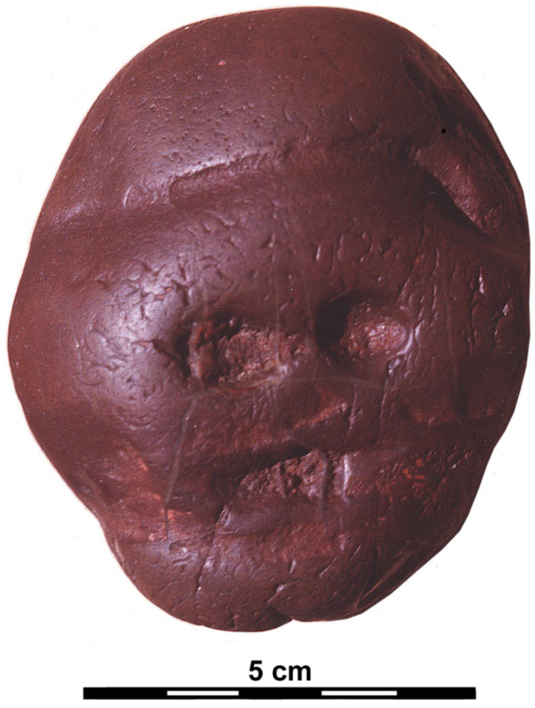
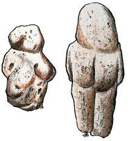
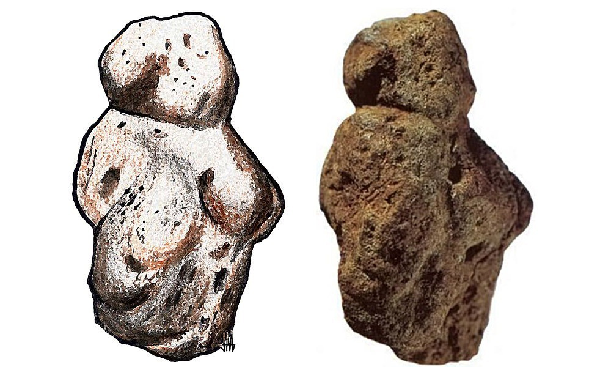
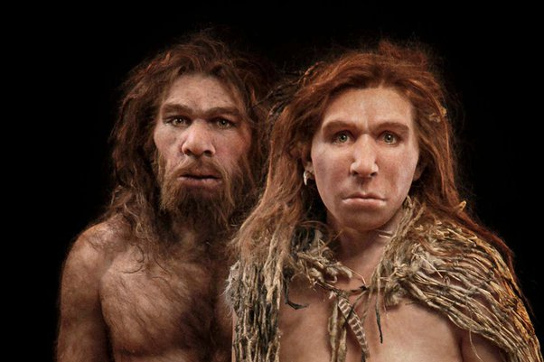
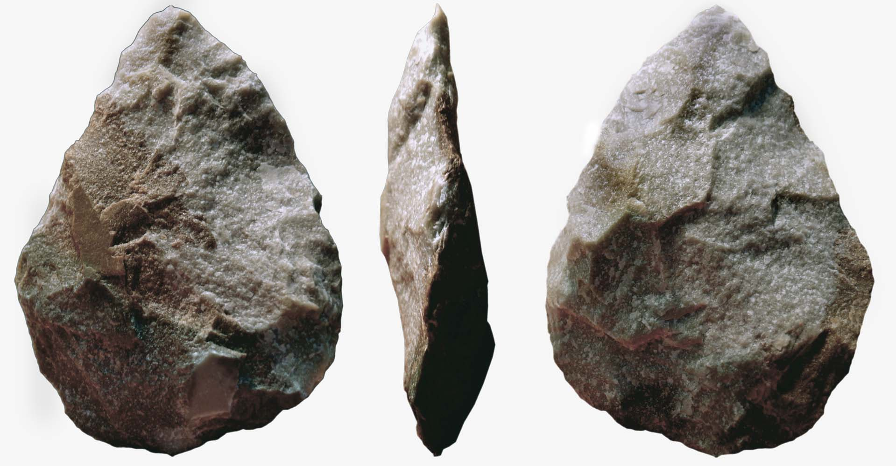
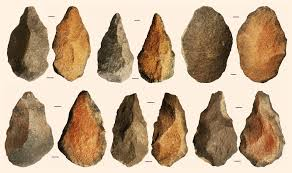

---23/06/22 17:15:30----------------------

Now we are going to talk about the movie Wall-E

Here you have the song that comes after the movie:

https://www.youtube.com/watch?v=hscu7cc1_2Y

You have robot Eve and robot Wall-E, they both go through paintings.
Each of these paintings is coming from a different time:

First you have the paintings on the walls of caves (caves are like big holes in mountains) (that was 60000 years ago)
These were painted during the ice age, these are the first examples of big art, paintings that are much larger than life on the walls of caves - that's where we got culture from, and some people say that language came from this time.

Then at 00:19 you are in painting that is just like the painting on the walls of a pyramid in ancient Egypt (from 5000-2300 years ago)
Egypt was one of the first places with cities and one of the first languages that wrote things down. 
History starts where we can find books what people wrote at the time, everything before that is the time before history - pre-history.

At 00:30 you get into a painting from ancient Greece - you see a lot of ornaments; this is the culture that tells us how to think. They taught us philosophy and mathematics, and critical thinking - that's when you ask questions why things are the way they are.
The Jews were also good at critical thinking - the prophets would ask their kinds questions, and even challenge them!

at 00:44 you are in a mosaic, that is a picture that is made from very little stones, they like these in ancient Rome (2500-1600 years ago)
Rome built a big empire, and united many people - most countries in Europe say that they come from this time.

at 01:00 comes a painting from China - that's where paper was invented, with very fine lines.

at 1:17 we get back to Europe during the renaissance - that's between six hundred and three hundred years ago in Italy
That's when Europe got back to the tradition of ancient Greece and ancient Rome, and when we learned things like science.
In art they learned about perspective, depth and Humanism - that people are the most important and should come first.

at 1:30 we get into 19th century France - the early impressionist; they taught us to draw what we feel, and not just what we see.

at 1:40 they are in a painting by Monet, many many small dots, like pixels.

at 1:47 they are in a field with sun flowers, just like Van Gogh

at 2:08 in a surrealist painting, where the roots of the tree come all into the boot where Wall-E found the plant/flower - here people started to draw ideas,

You see that two robots are going through a journey, as if they learn again what humans learned through their own journey, and all that through the eyes of art.
Art is like a kind of time machine, if you look at both the art and its time.
And that's what we will talk about now...

---

The very first art that we know about is here, it comes from three million years ago!

    

This small stone is a crystal, it looks a bit like a face, and the people of three million years ago added some scratches, to make it look more like a face.
This crystal comes not from the cave, you can find it 30 kilometer away from the cave, where our early ancestors lived.
This means they had to take and move the stone all by themselves!

Is that art? The stone could mean a lot to the people who brought it to the cave - they found it far away and had to keep it!

These people were before Humans, they are called Australopithecus - we know very little about this kind, we have only the bones of the head, and some tools that they made.
https://simple.wikipedia.org/wiki/Australopithecus

Venus of Berekhat Ram : a stone figure of a women that was found in Israel, you can see it in the Israel museum, it is from 280000 years ago!
It had some paint on it, so many scientist think that this was art.

This was before Humans- but we know much more about the artist! 

This is Homo Erectus scientists found much more than the bones of a head here, we know that he could walk and stand straight on his feet (that's what the name Homo Erectus says) https://simple.wikipedia.org/wiki/Homo_erectus

We think they looked like this

People know that they got out of Africa, they got to Europe and Asia, and even crossed the sea to the island of Java
You need boats to cross the sea to Indonesia, it is too hard to swim that distance!

They made very complicated tools like this one:

And this:

It takes hundred of hours to make one like this, you need to plan what to do.
You also need to teach your children how to make these, so they must have known how to talk, somehow.
Maybe they were talking by making signs with their hands, but we don't know exactly.

But we don't know for sure, they all died, and now we have no Homo Erectus to ask...

