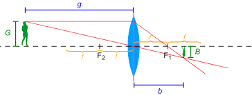
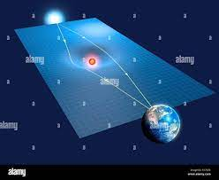
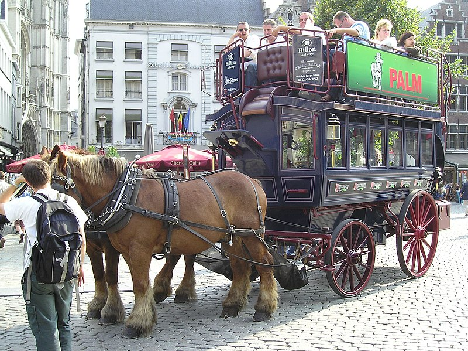
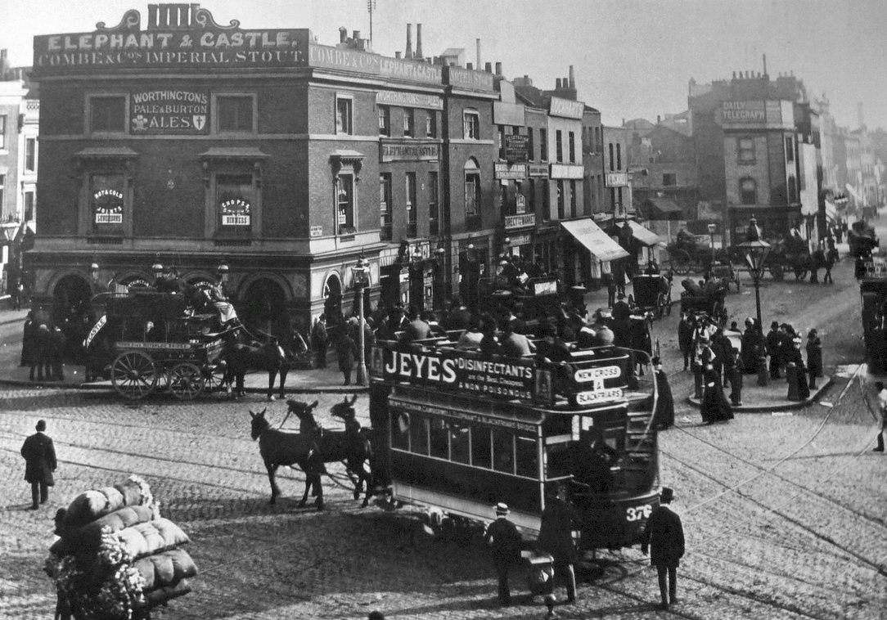
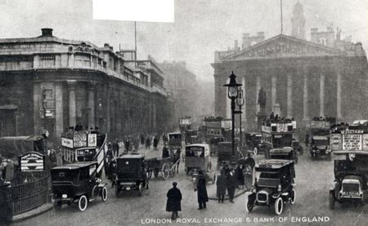
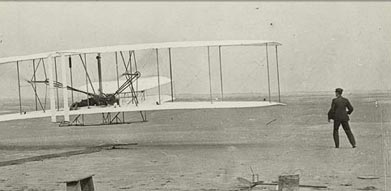
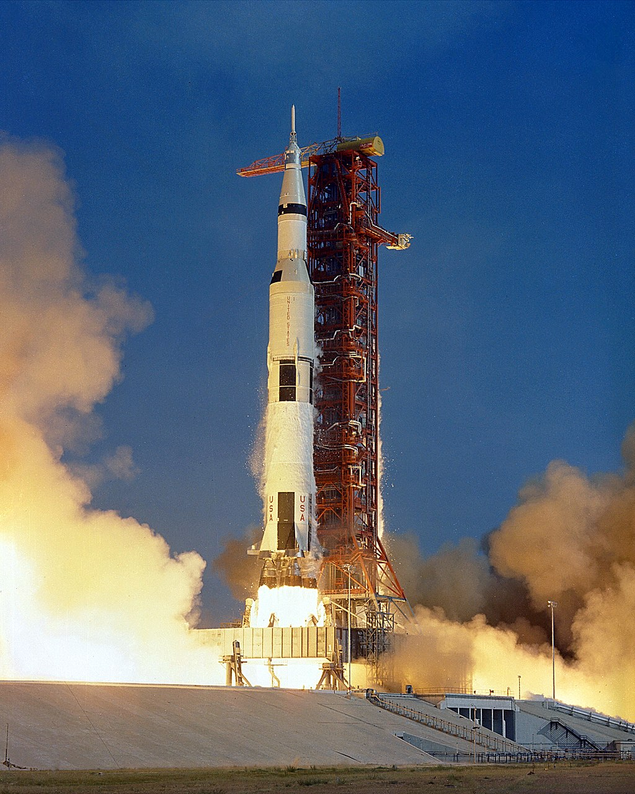
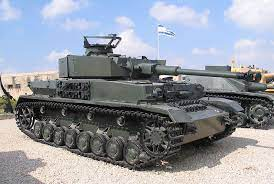
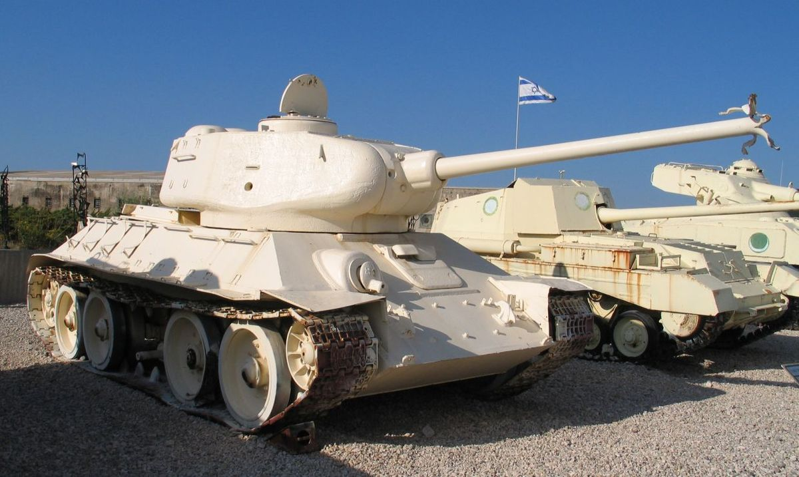

---11/05/22 10:06:48----------------------

(about savannah cats)

Here is a video of a very big cat.

This is a very big cat

<video src='media/kot.mov' width='478'/>

This kind of cat is called the Savannah cat. This kind of cat is very big and expensive, because her dad or granddad was a Serval or Lynx (that's a very big wild cat) and her mother was a regular cat.
You can read more about it in the simple English wikipedia  https://simple.wikipedia.org/wiki/Savannah_cat
and in the regular English wikipedia https://en.wikipedia.org/wiki/Savannah_cat
The Savannah cat is a new kind of cat, it is only some twenty years old.
The Savannah cat is not afraid of water. Also you can't take this cat to Australia, this is not allowed. 
In Australia they are afraid, that this cat can eat up many animals
Did you find out something interesting about the Savannah cat?
What do you think about wikipedia in simple English, is it easy to understand the text, or is it difficult for you?

---11/05/22 10:06:48----------------------

Here is an interesting space project: https://www.youtube.com/watch?v=lqzJewjZUkk

The sun is a very heavy thing; it is pulling everything towards itself at a distance, this is also called gravity.
(the funny thing is that nobody knows exactly how gravity is working, but we know that it is there and that we can measure it. 
If it would not work, then all of our machines would not be working...)

Now the sun also changes the shape of space around itself, that means that the light that passes around the sun is not going through straight line,
the light is a little bit bent.

This means that the sun is a bit like an objective in a camera, like a lense that moves all the light into one point.

This is a normal lense

Now the same thing is done by the Sun, that is called gravitational lensing.

The question is now: where is the place where the lines are coming into one point? This point is called the focus point, if you move there, then you can see the picture on the other side, and it looks larger!
That's how a telescope works.

Professor Slava Turishhev says, that the sun can be used as a very big space telescope. You could see planets that are turning around other stars!

You need to build a spaceship that travels very far away from the sun, to a distance that is 548 times the distance between the earth and the sun.

The most close distance to Pluto is 24 times the distance between the earth and the sun, and when Pluto is very far away then that's 49 times the distance between the earth and the sun.

It is now possible to build a spaseship that could do it!

The spaceship would need to travel around the sun, with a sail that gathers the energy from the sun. The sun would make the spaceship faster, so that it could travel the distance in 25 years.

--

How fast would that spaceship be?

548 times the distance between the earth and the sun is 548 * (150 million kilometres) = 82200 million kilometers

8220 million kilometers / 25 years = the spaceship needs to travel 3288 million kilometers in a year.

How many seconds are there in a year? 

3600 seconds per hour * 24 hours per day * 365 days per year = 31536000 seconds per year.

How many kilometers per second would the spaceship travel per year?

3288 million kilometers per year = 3288000000 kilometers per year /  31536000 seconds per year =  104.2 kilometers per second.

A spaceship that starts from earth needs to travel some eight kilometers per second.

--

A big problem is that the spaceship needs to travel some twenty five years. We don't know if the electronics on that spaceship would not break. A spaceship gets a lot of radiation that could damage the electronics.

Right now NASA has to decide, if they want to do such a project.

Please tell me, if that was an interesting story.
 

---11/05/22 20:57:09----------------------

One question that they sometimes ask at job interviews: How many filling stations are there in the usa? (A filling station is a place where a car can get fuel)

Of course there is no one right way to answer such a question; the place where they ask this question wants to see, how you solve a problem like this.  It is important to show, that you do something to solve the problem, and that you don't give up.

One way of solving the problem is by guessing:

Lets see, I know that there are 300 million people in the USA. 
Lets say that most families have four persons.
This would make 300.000.000 / 4 = 75.000.000 families.

if you say that there is one car per family then than that's 75.000.000 cars

lets say each car needs to get fuel once per week, that would make 75.000.000 times to fuel all cars per week.

75.000.000 / 7 days per week  == 10.000.000 times to fuel up per day.

Lets look at a fuel station, you need ten minutes to put the fuel into the car, that means a single pump can do six cars per hour, 
Lets say a pump works three hours per day without stopping, that means  3 * 6 = 18 cars per day for each pump. (the rush hours are three hours, that's where everyone is going to work)
A gas station has six lines, two pumps each, makes 12 pumps * 18 = 216 cars per day

times-to-fuel-up-all-cars-per-day / times-a-station-is-used-a-day = 10.000.000 / 216 =  46296 fuel stations would be needed.

--

A different way of solving this puzzle:

We live in a town of 100.000 people, we have four fuel stations in our town.
So that 300.000.000 / x = 100 000 / 4

4 * 300.000.000 / 100.000  == 4 * 30000 = 120000 

That's quite close - the real number of fuel stations in the USA is 115000 (says the internet)
https://www.marketwatch.com/story/how-many-gas-stations-are-in-us-how-many-will-there-be-in-10-years-2020-02-16a

--

What do we learn from this? The most simple way of thinking sometimes gives you very good numbers, that's because you have to guess fewer details!

--

Tricks like this are sometimes very important: one trick like this is the "German tank problem".
During world war 2 there was a German tank, the Panther tank https://en.wikipedia.org/wiki/Panther_tank
And it was important to know how many tanks of this type exist.

The Americans used a trick: They wrote down all the serial numbers for the engines of all tanks that they met.
A serial number is a number that is written on the engine, each new engine gets a new number, so the first engine gets the number 1, the second engine gets the number 2....

Lets say you know about the following serial numbers: 101, 134, 165, 201

So you use the formula:

NUMBER_OF_TANKS :=  (LARGEST_SERIAL_NUMBER * (NUMBER_OF_ITEMS_KNOWN + 1)) / NUMBER_OF_ITEMS_KNOWN

That would make 201 * (4+1) / 4 = 251 

After the war they checked that this was almost the same number of these tanks that did exist at the time!

https://www.theguardian.com/world/2006/jul/20/secondworldwar.tvandradio

In our time you can't use this trick: everyone uses random numbers for serial numbers in tanks, so that the number of tanks can't be guessed....
If you know about a trick, then there is a way to make the trick useless...

--

Now in ten years you will probably have other interview questions. All the cars will be electric cars, like the Tesla, and no one will know what a filling station was good for.

---13/05/22 01:22:20----------------------

--

Something about horses:

A hundred and thirty years ago they had busses like this, in the 1890ies 

This is an Omnibus, a horse is pulling it.

And London would look like this:

Now ten years later, in 1900, and you don't see a lot of horses in London:
Interesting that many of these cars were electric, they had batteries, just like the Tesla now!
But then they stopped making electric cars, as cars on petrol became better and better.

Another thing with airplanes: This is the first airplaine, the Wright brothers built it in 1903, the first flight took 12 seconds over 36 meters.

And that is the rocket that tooks us to the moon, sixty six years later. 

This rocket is producing as much energy, for a few minutes, as all of the electric power stations in Great Britain!

But what about the horses? It turns out they were used a lot in wars, like world war one from 1914 to 1918: https://en.wikipedia.org/wiki/Horses_in_World_War_I

In world war one there was a horse for every two man.
That means that the number of horses was equal to the number of soldiers divided by two.

At some very bad battle they said that a horse is more important than a soldier, a soldier can be replaced, but a horse can't be replaced. (the battle of Passchendaele)

There are monuments to the horses in world war one ![][media/horse-monument-ww1.jpeg]

And they had still a lot of horses in world war two, some twenty one years later, in 1939.

The Soviet army didn't have a lot of horses in 1941, when the Nazis came. But the Red army lost a lot of its machines in the first months of the war.
What saved the Red army: some five hundred thousand horses that came from Mongolia, the land of the horses!
Even today they have more horses than people in Mongolia, and once upon a time Mongolia was a very big country that ruled over half the world!

In Moscow they have a monument to the horses in world war two ![][media/horse-monument-moscow.jpg]

And the bad Nazis also had a lot of horses, they had a problem with fuel, they did not have a lot of fuel and hat to save it.
The German army had a million horses, all the time. Each infantry division had thousands of horses.

The whole war two was a lot about fuel, the big battle of Stalingrad was the biggest battle, and it was about fuel: Germany tried to cut of Russia from its fuel, that came from the south, from Baku in Azerbaidzhan.

So the war today in Ukraine is the first big war in Europe without horses!

--

You can see tanks from world war two in the Latrun tank museum, right next to Modiin.

Here is a Panzer-4 from the bad German army, some twenty years later it fought against us, for Syria against Israel!  

And here is the Russian T34 in Latrun, that is the tank that won world war 2 and saved our grandfathers and grandmothers: 

Here in Latrun one can climb and stand on top of the tank, that's because no one wants to serve in a Tank, these are not popular army units.

