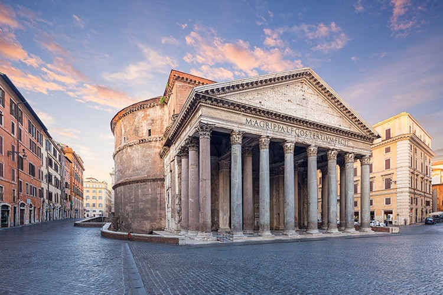
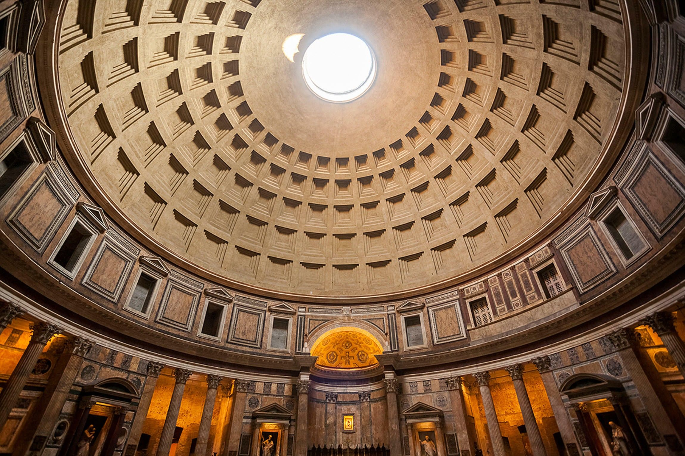
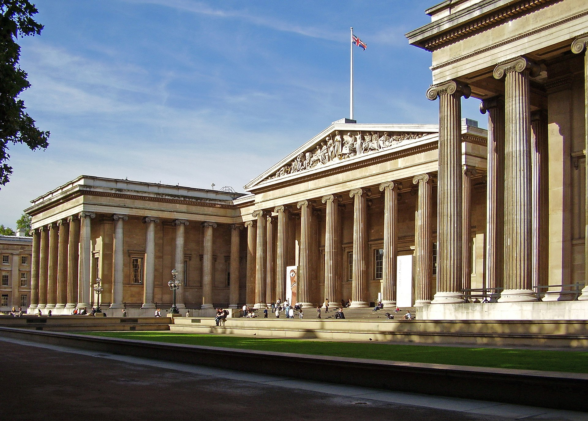
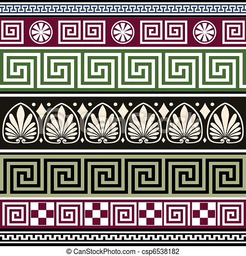
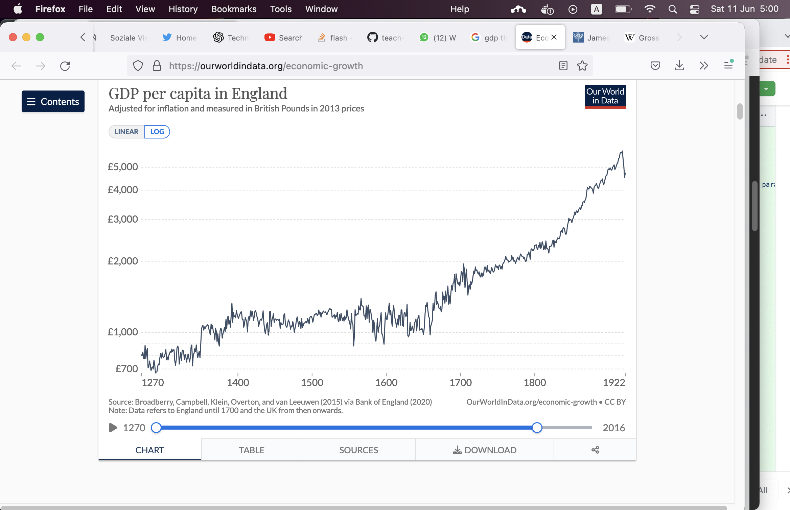
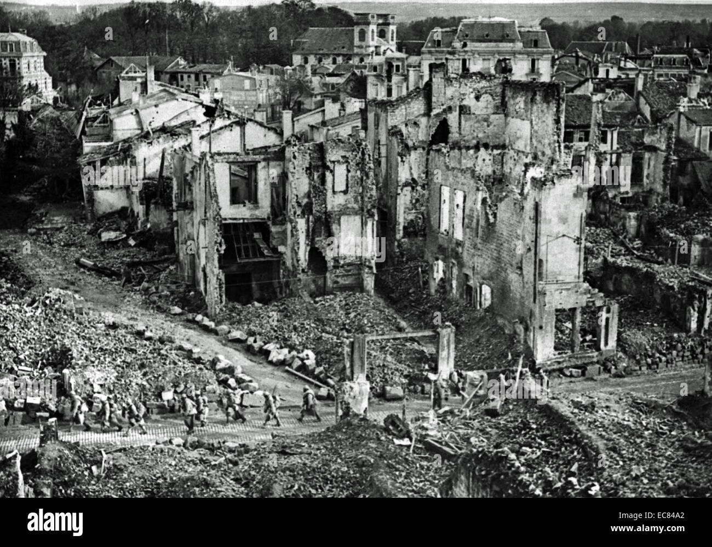
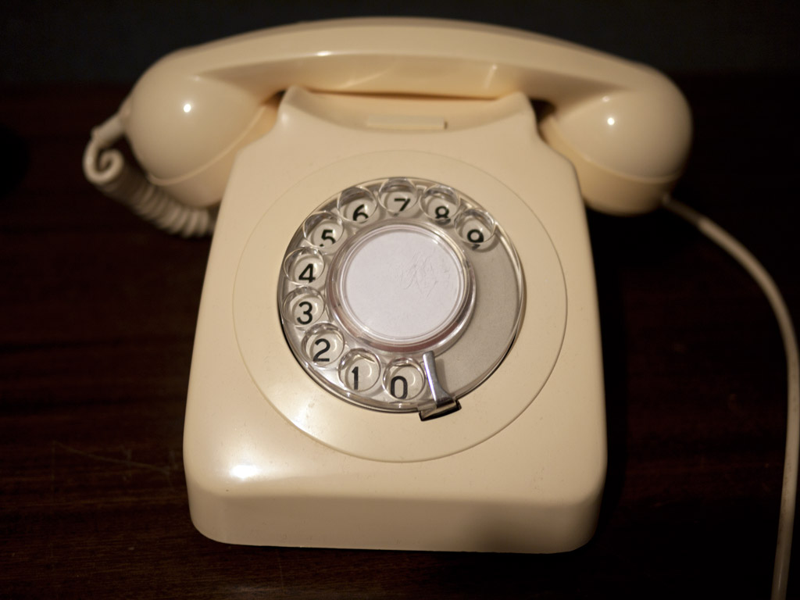
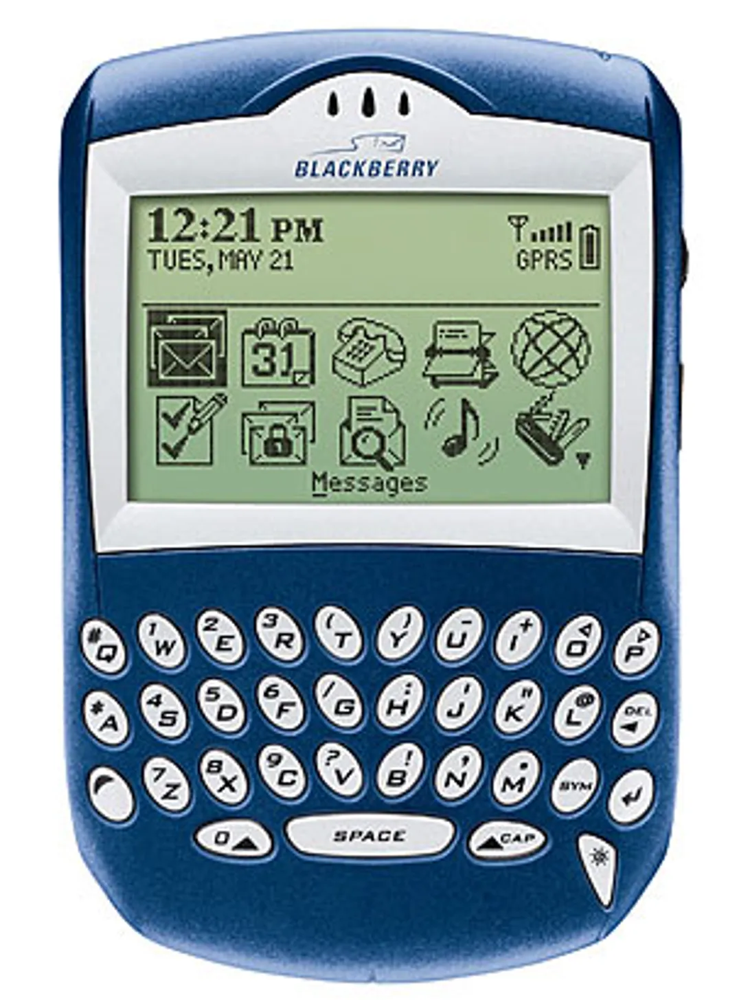

---11/05/22 10:06:48----------------------

(about savannah cats)

Here is a video of a very big cat.

This is a very big cat

https://raw.githubusercontent.com/MoserMichael/teach-your-children-well/master/media/kot.mov

This kind of cat is called the Savannah cat. This kind of cat is very big and expensive, because her dad or granddad was a Serval or Lynx (that's a very big wild cat) and her mother was a regular cat.
You can read more about it in the simple English wikipedia  https://simple.wikipedia.org/wiki/Savannah_cat
and in the regular English wikipedia https://en.wikipedia.org/wiki/Savannah_cat
The Savannah cat is a new kind of cat, it is only some twenty years old.
The Savannah cat is not afraid of water. Also you can't take this cat to Australia, this is not allowed. 
In Australia they are afraid, that this cat can eat up many animals
Did you find out something interesting about the Savannah cat?
What do you think about wikipedia in simple English, is it easy to understand the text, or is it difficult for you?

---11/05/22 10:06:48----------------------

Here is an interesting space project: https://www.youtube.com/watch?v=lqzJewjZUkk

The sun is a very heavy thing; it is pulling everything towards itself at a distance, this is also called gravity.
(the funny thing is that nobody knows exactly how gravity is working, but we know that it is there and that we can measure it. 
If it would not work, then all of our machines would not be working...)

Now the sun also changes the shape of space around itself, that means that the light that passes around the sun is not going through straight line,
the light is a little bit bent.

This means that the sun is a bit like an objective in a camera, like a lense that moves all the light into one point.

This is a normal lense

Now the same thing is done by the Sun, that is called gravitational lensing.

The question is now: where is the place where the lines are coming into one point? This point is called the focus point, if you move there, then you can see the picture on the other side, and it looks larger!
That's how a telescope works.

Professor Slava Turishhev says, that the sun can be used as a very big space telescope. You could see planets that are turning around other stars!

You need to build a spaceship that travels very far away from the sun, to a distance that is 548 times the distance between the earth and the sun.

The most close distance to Pluto is 24 times the distance between the earth and the sun, and when Pluto is very far away then that's 49 times the distance between the earth and the sun.

It is now possible to build a spaseship that could do it!

The spaceship would need to travel around the sun, with a sail that gathers the energy from the sun. The sun would make the spaceship faster, so that it could travel the distance in 25 years.

--

How fast would that spaceship be?

548 times the distance between the earth and the sun is 548 * (150 million kilometres) = 82200 million kilometers

8220 million kilometers / 25 years = the spaceship needs to travel 3288 million kilometers in a year.

How many seconds are there in a year? 

3600 seconds per hour * 24 hours per day * 365 days per year = 31536000 seconds per year.

How many kilometers per second would the spaceship travel per year?

3288 million kilometers per year = 3288000000 kilometers per year /  31536000 seconds per year =  104.2 kilometers per second.

A normal spaceship that starts from earth and goes to the international space station is going is much slower, it has a speed of some eight kilometers per second.

So this one must be 104.2 / 8 = 13.025 times faster!

--

A big problem is that the spaceship needs to travel some twenty five years. We don't know if the electronics on that spaceship would not break with this amount of radiation. A spaceship gets a lot of radiation that could damage the electronics.

Right now NASA has to decide, if they want to do such a project.

Please tell me, if that was an interesting story.
 

---11/05/22 20:57:09----------------------

One question that they sometimes ask at job interviews: How many filling stations are there in the usa? (A filling station is a place where a car can get fuel for your car)

Of course there is no one right way to answer such a question; the place where they ask this question wants to see, how you solve a problem like this.  It is important to show, that you do something to solve the problem, and that you don't give up.

One way of solving the problem is by guessing:

Lets see, I know that there are 300 million people in the USA. 
Lets say that most families have four persons.
This would make 300.000.000 / 4 = 75.000.000 families.

if you say that there is one car per family then than that's 75.000.000 cars

lets say each car needs to get fuel once per week, that would make 75.000.000 times to fuel all cars per week.

75.000.000 / 7 days per week  == 10.000.000 times to fuel up per day.

Lets look at a fuel station, you need ten minutes to put the fuel into the car, that means a single pump can do six cars per hour, 
Lets say a pump works three hours per day without stopping, that means  3 * 6 = 18 cars per day for each pump. (the rush hours are three hours, that's where everyone is going to work)
A gas station has six lines, two pumps each, makes 12 pumps * 18 = 216 cars per day

times-to-fuel-up-all-cars-per-day / times-a-station-is-used-a-day = 10.000.000 / 216 =  46296 fuel stations would be needed.

--

A different way of solving this puzzle:

We live in a town of 100.000 people, we have four fuel stations in our town.
So that 300.000.000 / x = 100 000 / 4

x = 4 * 300.000.000 / 100.000  == 4 * 30000 = 120000 

That's quite close - the real number of fuel stations in the USA is 115000 (says the internet)
https://www.marketwatch.com/story/how-many-gas-stations-are-in-us-how-many-will-there-be-in-10-years-2020-02-16a

--

What do we learn from this? The most simple way of thinking sometimes gives you very good numbers, that's because you have to guess fewer details!

--

Tricks like this are sometimes very important: one trick like this is the "German tank problem".
During world war 2 there was a German tank, the Panther tank https://en.wikipedia.org/wiki/Panther_tank
And it was important to know how many tanks of this type exist.

The Americans used a trick: They wrote down all the serial numbers for the engines of all tanks that they met.
A serial number is a number that is written on the engine, each new engine gets a new number, so the first engine gets the number 1, the second engine gets the number 2....

Lets say you know about the following serial numbers: 101, 134, 165, 201

So you use the formula:

NUMBER_OF_TANKS :=  (LARGEST_SERIAL_NUMBER * (NUMBER_OF_ITEMS_KNOWN + 1)) / NUMBER_OF_ITEMS_KNOWN

That would make 201 * (4+1) / 4 = 251 

After the war they checked that this was almost the same number of these tanks that did exist at the time!

https://www.theguardian.com/world/2006/jul/20/secondworldwar.tvandradio

In our time you can't use this trick: everyone uses random numbers for serial numbers in tanks, so that the number of tanks can't be guessed....
If you know about a trick, then there is a way to make the trick useless...

--

Now in ten years you will probably have other interview questions. All the cars will be electric cars, like the Tesla, and no one will know what a filling station was good for.

---13/05/22 01:22:20----------------------

--

Something about horses:

A hundred and thirty years ago they had busses like this, in the 1890ies 

This is an Omnibus, a horse is pulling it.

And London would look like this:

Now ten years later, in 1900, and you don't see a lot of horses in London:
Interesting that many of these cars were electric, they had batteries, just like the Tesla now!
But then they stopped making electric cars, as cars on petrol became better and better.

Another thing with airplanes: This is the first airplaine, the Wright brothers built it in 1903, the first flight took 12 seconds over 36 meters.

And that is the rocket that tooks us to the moon, sixty six years later. 

This rocket is producing as much energy, for a few minutes, as all of the electric power stations in Great Britain!

But what about the horses? It turns out they were used a lot in wars, like world war one from 1914 to 1918: https://en.wikipedia.org/wiki/Horses_in_World_War_I

In world war one there was a horse for every two man.
That means that the number of horses was equal to the number of soldiers divided by two.

At some very bad battle they said that a horse is more important than a soldier, a soldier can be replaced, but a horse can't be replaced. (the battle of Passchendaele)

There are monuments to the horses in world war one 

And they had still a lot of horses in world war two, some twenty one years later, in 1939.

The Soviet army didn't have a lot of horses in 1941, when the Nazis came. But the Red army lost a lot of its machines in the first months of the war.
What saved the Red army: some five hundred thousand horses that came from Mongolia, the land of the horses!
Even today they have more horses than people in Mongolia, and once upon a time Mongolia was a very big country that ruled over half the world!

In Moscow they have a monument to the horses in world war two 

And the bad Nazis also had a lot of horses, they had a problem with fuel, they did not have a lot of fuel and hat to save it.
The German army had a million horses, all the time. Each infantry division had thousands of horses.

The whole war two was a lot about fuel, the big battle of Stalingrad was the biggest battle, and it was about fuel: Germany tried to cut of Russia from its fuel, that came from the south, from Baku in Azerbaidzhan.

So the war today in Ukraine is the first big war in Europe without horses!

--

You can see tanks from world war two in the Latrun tank museum, right next to Modiin.

Here is a Panzer-4 from the bad German army, some twenty years later it fought against us, for Syria against Israel!  

And here is the Russian T34 in Latrun, that is the tank that won world war 2 and saved our grandfathers and grandmothers: 

Here in Latrun one can climb and stand on top of the tank, that's because no one wants to serve in a Tank, these are not popular army units.

---23/05/22 13:47:38----------------------

Today I want to talk about design of things, that is the way that things look like. This can be big things like houses and buildings like schools. This can also also about smaller things that we have in our house: chairs, tables, lamps, tea pots.

One hundred and fifty years ago people wanted houses and buildings to look like they did in the Roman Empire and classical Greece, the Roman Empire existed some two thousand years ago, that was a long long time ago.

An example of a building from the Roman Empire: the Pantheon in the city of Rome, this was a Roman temple when it was built, now it is a church.
It is the only building from that time that is still standing - the same as it was built.

This building tells you something: we could build such a big thing, and we have a lot of power, so you better do what we say, else...

--

You can see the same style of building in the late nineteenth century, almost two thousand years later, like with the building of the British museum:

The main court of the USA - the supreme court, also built in the nineteenth century

Also they liked to use the same ornaments in the nineteenth century, like in ancient Greece.
The old ornaments:

Here is a room from the late 19th century designed like this:

Showing off how strong your are was very important in the late nineteenth century.
Most of Europe had kings and queens and they didn't like changes, because any change of government would have thrown out the kings and the queens.

Germany had the kaiser Wilhelm I and Wilhelm II - a kaiser is a kind of king.
Austria had an Emperor was a very big country, it ruled over Hungary, Czechia, Slovakia, big parts of former Jugoslavia and Poland, an emperor is also a kind of king
Russia had an Emperor and Britain had a queen (but she doesn't have to say anything)

--

Then came world war one, from 1914 to 1918, that was a terrible war, where some fourteen million people died, in all of Europe.

That was one big and terrible war, after the war most of the kinds and queen were thrown out (except for the queen of England)

Most countries got a parliament instead of them (except for Russia, which got a dictatorship instead)

-- 

Now people were asking how stuff like houses lamps and tea pots should look like...

What we got instead of neoclassical design is a modern design of things that you can still see today at Ikea!

Someone had to invent this design, this was done in Germany at a school called the Bauhaus (that means a house for the art of building).

What they did was very new: they said that we have to find new ways of thinking about design.

To do this they had a lot of people in one school:
 - they had artists who knew how to paint modern paintings
 - they had craftsmen - to learn how to do things like lamps and tea pots
 - they had architect - to learn how to do new kinds of houses

We will learn more about the Bauhaus in the next lesson.

---25/05/22 16:46:38----------------------

And now for something completely different:

This is a special rainbow, it is very rare.

You need a cloud that is very high, the cloud is made of ice crystal, all in the following shape

Now the sun needs to shine, so that the light comes from a special angle, that's when you get this rainbow.

I saw this wonder here:  [here](https://twitter.com/FabulousWeird/status/1529225729216393216)

---11/06/22 05:40:56----------------------

This animal is called a "sea angel"

https://github.com/MoserMichael/teach-your-children-well/releases/download/0.0.1/sea-angle.mp4

It is a very small animal, living in a very cold place, the arctic ocean.

It has also another name, says the English Wikipedia - it is called "whale food", because whales do it it a lot. The sea angel is not very big, it is several centimeters long https://en.wikipedia.org/wiki/Clione_limacina

Wikipedia in Russian says that scientist have studied the brain of the sea angel, because it has a very simple brain, and it is easy to study. This way they can study, how the neurons talk to each other. Neurons are very small cells in the brain. https://ru.wikipedia.org/wiki/%D0%9C%D0%BE%D1%80%D1%81%D0%BA%D0%BE%D0%B9_%D0%B0%D0%BD%D0%B3%D0%B5%D0%BB_(%D0%BC%D0%BE%D0%BB%D0%BB%D1%8E%D1%81%D0%BA)

You can see - it is easy to learn different things, if you look at the same wikipedia article that is written in different languages...

And pokemon manaphy has been inspired by the sea angel!

And a sea angel is eating sea butterflies, but it can stay a year without food!!!

---11/06/22 05:50:40----------------------

Back to the Bauhaus, and to how things are designed

Now we talked about world war one, and that it came as a big shock to many people.
Most people thought that things can only get better, they were very optimistic, here is why:

This is a graph, it tells you the cost of all things that were made in England for any year from 1200 to 1917.

You see that things were really getting better, the world was getting richer - ever since 1764, when James Watt invented the steam engine.

Here is a steam engine can create a lot of new energy. 

you burn coal, it warms water that turns into steam, this steam moves the machine forward!

Without the steam engine we had the energy of horses and donkeys. Well, we had the power of a flowing river, you can make the flowing water move a big wheel.
There is a problem with that - you can only have that next to a river, but you can put a steam engine almost everywhere.

And a hundred years after the steam engine people also started to use electricity, that's even more energy.
Some people were getting richer and richer!

Now with all this power you can make much better weapons too, these weapons can destroy a lot of things. Progress is not always good, it has a dark side as well...

You had a lot of destruction in world war one, that was the first modern war. Everything new was used to kill even more soldiers, you got very new stuff like air planes, u-boats that swim under the sea and poison gas and lots and lots of very big guns that can blow up a big area with dynamite - that was a new explosive much stronger than gun powder.

That was a very big battle - a battle of Verdun, about a million soldiers died there!

So after world war one, a lot of people thought: what shall we do now?

One thing that helps people in difficult times is art, so you had a lot of changes in art.
Some people became interested in the Chinese and Japanese philosophy and art - they thought that Europe did not have all the answers, and that they had to look for new places for answers.

Tao or Dao is a way of thinking from China, they want to find harmony with nature, they also say that one should do as little as possible - because you would mess up nature if you do too much.  
In Japanese art you have Wabi-Sabi, here artists try to have a beautiful painting with as little as possible, this is called minimalism.

Interesting that Martin Buber was saying that Tao/Daoism has many similarities with Hassidism.

You have a similar style of thinking in tech, Antoine de Saint-Exupéry is a french writer, he wrote the following (I used to read his book a lot, when I was your age :-)
He says that an airplane is nearest to perfection, when ... there is no detail that can be removed from it.

“And now, having spoken of the men born of the pilot's craft, I shall say something about the tool with which they work - the airplane. Have you looked at a modern airplane? Have you followed from year to year the evolution of its lines? Have you ever thought, not only about the airplane but about whatever man builds, that all of man's industrial efforts, all his computations and calculations, all the nights spent over working draughts and blueprints, invariably culminate in the production of a thing whose sole and guiding principle is the ultimate principle of simplicity? ...
In anything at all, perfection is finally attained not when there is no longer anything to add, but when there is no longer anything to take away, when a body has been stripped down to its nakedness."

From "Wind, Sand and Stars" Antoine de Saint-Exupere

In a way this minimalism is similar to the sense of beauty in a mathematical proof, this one is also beautiful, if you can't take anything away from it.

That's what you later got in the esthetics of Bauhaus.

Ludwig Mies van der Rohe was the chief architect of Bauhaus and he said "Less is more" !

Much later you can see the same thing with ... telephones!

We had this telephone at our home, when I was a little kid. How do you dial a number? Stick your finger in a number and move the hole as far as possible!

Later you had these - easier to use, but it still needs to be connected to a plug in the wall

Later you could put them in your pocket, the first cell phone that I got looked like this (you could play snake on it ;-)

Then these phones got a stronger computer, and you would have something like this! It even has a keyboard!

(some people actually say that it is much easier to type with the keyboard on a blackberry - easier than what you have now)

But then cam Steve Jobs and asked: what can you remove from the phone? Is there something that you could do without?

(Actually you had to add a touchpad for that, so it's not only removing stuff)

---

... and here is the full graph for the GDP growth in Britain, for almost a thousand years. You see that science and technology really changed things...

... But some people say that there is a big error here: the same amount of money today is worth less than a hundred years ago. That's called inflation - one pound from a thousand years ago could bye many more things than today.

---23/06/22 10:49:18----------------------

Bauhaus wrapup:

So the Bauhaus was about minimalism - that is about finding a simple way to express your art, and about bringing this art to everybody - in the form of designing things like chairs, lamps, houses, fonts for writing, clothes and paintings.

Like with the Bauhaus chair by Marcel Breuer - so you see where Ikea is getting their ideas...

This lamp by Wilhelm Wagenfeld

And this teapot by the same artist

Minimalism means that you use only a few features, just the most important ones. So you need to know your stuff well: know a lot about shapes, materials, movement.

Students at the Bauhaus had a foundation course - here they learned about things likes basic shapes - these are square, triangle and circle - everything is reduced to these shapes

They learned about movement and had theater classes

The teacher of this course said: "before you draw a tiger, you have to roar like a tiger" - you need to experience 

After this first course they were learning about materials and how to use them in different workshops - metal workshop, weaving workshops, architecture workshops, etc.

In later years the school focused on architecture - we see a lot of that in Tel-Aviv, which is called the "white city", there are a lot of building that were built like this:

 

Most of the artists had to go to other countries, when the Nazis took power in Germany.
This style then became very common in a lot of places, all around the world.
Tel-Aviv was a city that was under constructions, a city was growing fast in that time, and a lot of buildings were built in that style.

Here is an interesting documentary on the subject: https://www.youtube.com/watch?v=2a45UBCIbJc

 

